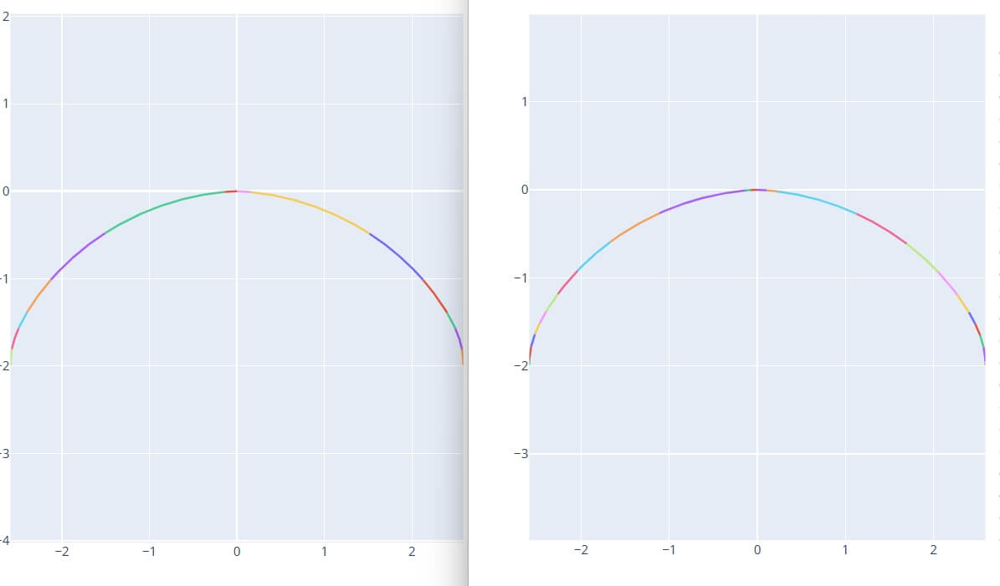

# 高级参数 - 初始化配置

本节介绍初始化配置中的高级选项。用户可根据具体加工需求调整这些参数，以进一步优化加工过程、提升最终精度。

## 滚轮圆弧半径

* **定义**: 设置修整器上安装的滚轮（或触笔）尖端的圆弧半径。
* **单位**: $mm$
* **说明**: 机床实际执行的修整轨迹是目标砂轮齿型轮廓线按此半径值进行的等距偏置线。通常情况下，**滚轮圆弧半径越小**，越有可能精确地修整出形状更复杂的砂轮齿型。

## 最终曲线点密度

* **定义**: 控制生成修整程序时，构成连续修整轨迹的离散点数量。
* **默认值**: $600$ 点
* **影响**:
    * **更高密度**: 提高轨迹精度，更逼近理论曲线。
    * **更低密度**: 减少代码行数，可能加快程序在机床上的执行速度。
* **权衡**: 请根据精度要求和机床性能选择合适的点密度。过高的密度会显著增加代码量并可能降低执行效率。

## 螺旋面生成角度

* **定义**: 软件内部在计算砂轮与工件滚道接触线时，动态生成一个滚道螺旋曲面的范围角度。
* **背景**: 当**砂轮安装角**与工件**标准螺旋升角**不一致（即干涉磨削）时，接触线会是一条复杂的空间曲线。角度差异越大，这条空间曲线在螺旋面上的分布范围越广。
* **设置**: 此参数定义了计算接触线时所考虑的螺旋面包络角度。
* **推荐**: **默认值 $90$ 度** 通常足以覆盖接触线的主要区域，一般无需修改。

## 齿高延长高度

* **定义**: 修整曲线终点沿曲线方向延长，设置齿高方向延长高度值。
* **单位**: $mm$
* **说明**: 设置为0则齿高和输入齿型的标准法向齿型的高度一致。

## 内收角度

* **定义**: 齿高延长高度部分延长线向齿型内测旋转的角度。
* **单位**: $°$
* **作用**: 用于调整滚道孔口过切部分形状。

## 齿根倒圆半径

* **定义**: 在砂轮根部（对应工件齿顶）设置左右两侧的倒圆半径。
* **单位**: $mm$

## 水平延长长度

* **定义**: 在齿型两侧设置水平方向的延长长度。
* **单位**: $mm$

## 拟合圆弧

* **功能**: 将计算出的离散点修整轨迹拟合为一系列 G02/G03 圆弧指令。
* **优点**:
    * **显著减少 G 代码行数**。
    * 提高程序在 CNC 系统上的**执行效率**和**平滑性**。
* **选项**:
    * **启用/禁用**: 控制是否执行圆弧拟合。
    * **G3 ⇆ G2**: 若机床坐标系定义或圆弧插补方向与标准不同，可能需要勾选此项来交换 G02 和 G03 指令。

## 拟合误差

* **定义**: 在启用**拟合圆弧**功能时，此参数控制拟合出的圆弧与原始离散点轨迹之间的最大允许偏差。
* **单位**: $mm$
* **推荐**: **建议设置为 1 或根据实际精度需求调整**。这是一个在精度和代码量之间取得良好平衡的常用值。

以下为拟合误差设置为10和1时，圆弧拟合的对比图：

## Siemens程序加密

* **功能**: 生成专门针对西门子系统的加密格式程序。
* **注意**: 此功能通常仅在 Windows 系统下有效。

## 法向作为砂轮廓形

* **功能**: 当砂轮安装角设置为标准螺旋角时，直接使用标准法向齿型作为砂轮廓形。
* **应用场景**: 仅在勾选了“标准螺旋角”自动设置安装角的情况下建议开启。使能后输出的修整代码和曲线和输入的标准法向齿型一致。

## 轮廓x0法向匹配齿型x0 (转子)

* **功能**: 如果齿型不对称且在 x0 处的曲线是平滑过渡的，需要打开此选项（常用于转子加工）。

## 输入方式 (砂轮杆偏移 / 砂轮直径)

* **功能**: 切换基本参数页面的输入模式。
    * **砂轮杆偏移**: 输入砂轮杆相对工件中心的最大最小偏移距离。通常用于内螺纹加工。
    * **砂轮直径**: 直接输入需要使用的最大最小砂轮直径范围。通常用于外螺纹加工。

## 外螺纹模式

* **选项**: `普通砂轮` / `内旋风铣`
* **说明**: 在进行外螺纹加工时，选择对应的加工模式。

## 输出程序路径

* **定义**: 指定用于存放生成的砂轮修整 G 代码及相关分析文件的根目录。

---

# 高级参数 - 程序信息

本节介绍如何配置生成的 G 代码文件中的具体指令和辅助信息。

## 程序头信息

* **功能**: 允许用户在生成的 G 代码文件顶部添加自定义文本注释。

## 程序头加载齿形信息

* **选项**: `是` / `否`
* **说明**: 设置是否在生成的程序头部分自动加载当前齿型的关键参数信息。

## 程序模式

* **选项**: `模式-0` 到 `模式-100`
* **说明**: 根据不同机床的系统要求或加工逻辑，选择对应的程序输出模式。

## 当前砂轮直径变量

* **定义**: 设置程序中代表当前砂轮直径的系统变量名称（如 `WHEEL_DIA`）。

## 当前修整侧变量

* **定义**: 设置程序中代表当前修整侧（0右/1左）的系统变量名称（如 `DRESS_SIDE`）。

## 读取程序信息变量

* **定义**: 设置程序中用于触发读取程序信息逻辑的变量（1为读取）。

## 修整轴名称

* **定义**: 设置机床修整时的轴名称。
    * **水平轴**: 如 `W`。
    * **进刀轴**: 如 `X`。

## 进刀方向

* **选项**: `正向` / `负向`
* **说明**: 设置修整时的进刀补偿方向。
