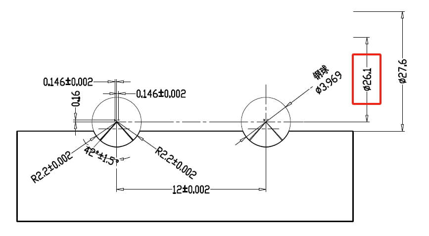
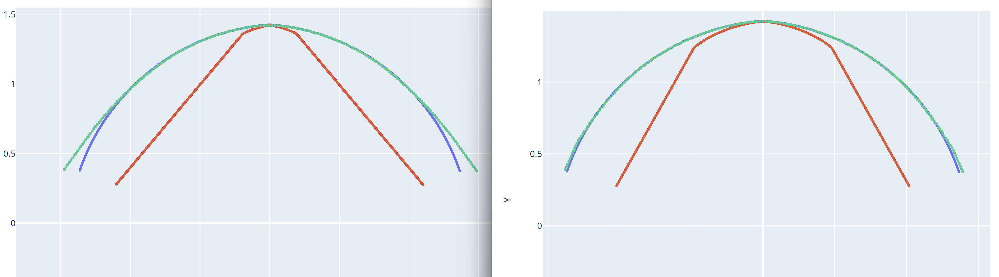
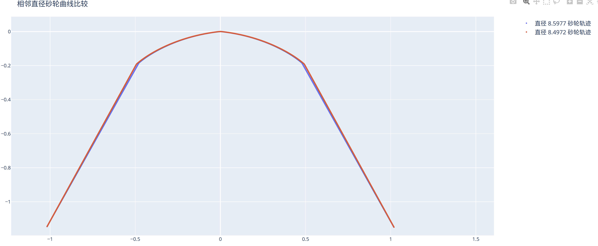

# 基本参数

本节详细介绍软件中最常用的基本参数设置项，涵盖工件参数、砂轮参数、齿型 DXF 文件及类型等关键信息。

## 工件类型

* **选项**: `内螺纹` / `外螺纹`
* **设置**: 请根据实际加工的工件选择对应的类型。

## 工件中径

* **定义**: 设置工件的中径尺寸。
* **单位**: $mm$
* **说明**: 此参数通常可在工件图纸中找到。例如，在下图红框中即标示了中径尺寸：
    
    *图 1: 工件中径在图纸中的标注示例*

    **使用绘图工具生成齿型文件并导入后，通常不需要手动输入中径，软件会自动读取。**

## 导程

* **定义**: 设置工件的导程。
* **单位**: $mm$
* **说明**:
    * 对于单头螺纹（或丝杠），**导程 = 螺距**。
    * 对于多头螺纹（或丝杠），**导程 = 螺距 × 头数**。
    * 蜗杆齿型导入后会自动读取导程，无需手动输入。

## 砂轮杆偏移工件中心最小距离

* **高级参数-初始化配置**中设置**输入方式：砂轮杆偏移**时可见。
* **定义**: 砂轮中心线相对于工件中心线的最小偏移量。偏移距离为 $0$ 时，表示砂轮中心与工件中心重合。
* **关联性**: 此参数与**砂轮直径**紧密相关，并直接影响计算生成的**砂轮轮廓曲线**。
* **设置指南**:

    * **内螺纹情况**:
        * 理论最小偏移可设置为 $0$（即砂轮在工件中心加工），此时允许使用的**砂轮直径最大**。
        * **注意**: 过小的偏移距离（包括 $0$）可能导致滚道接触线中的**无效区域增大**，进而使实际加工出的滚道与目标滚道产生较大偏差。在双圆弧和三角齿型中都有影响，需要测试不同偏移距离下的**模拟计算结果**和**标准法向曲线**的图形差异情况，来确定实际可用的最小偏移。
        * 下图对比了偏移距离为 $4mm$ 和 $5mm$ 时，模拟计算结果和标准曲线的对比情况：
            
            *图 2: 砂轮杆偏移对实际加工的影响 (左: 4mm, 右: 5mm)*
        * 观察可见，偏移距离越小，两侧曲线偏移标准曲线的部分越多，可能导致后续滚道部分无法按预期形状正确加工。

    * **外螺纹情况**:
        * 建议设置为输入最大/最小砂轮直径模式，**高级参数-初始化配置**中设置**输入方式：砂轮直径**。

## 砂轮杆偏移工件中心最大距离

* **高级参数-初始化配置**中设置**输入方式：砂轮杆偏移**时可见。
* **定义**: 砂轮中心线相对于工件中心线的最大允许偏移量。
* **设置指南**:

    * **内螺纹情况**:
        * 最大偏移距离主要受**工件内径**和**砂轮安装角**的限制。
        * 偏移距离越大，所需的**砂轮直径越小**。
        * **注意**: 设置的偏移距离**不能过大**，否则可能导致砂轮杆在加工过程中与工件内壁发生**干涉碰撞**。
        * 您可以通过查阅 **[分析工具] -> [最大偏移计算]** 章节（如果手册中有此章节）或使用相关功能来辅助计算允许的最大偏移值。

    * **外螺纹情况**:
        * 建议设置为输入最大/最小砂轮直径模式，**高级参数-初始化配置**中设置**输入方式：砂轮直径**。

## 最大砂轮直径

* **高级参数-初始化配置**中设置**输入方式：砂轮直径**时可见。
* **定义**: 最大允许砂轮直径。
* **设置指南**:

    * **内螺纹情况**:
        * 建议设置为输入最大/最小砂轮杆偏移模式，**高级参数-初始化配置**中设置**输入方式：砂轮杆偏移**。

    * **外螺纹情况**:
        * 设置为加工时所能达到的最大砂轮直径。

## 最小砂轮直径

* **高级参数-初始化配置**中设置**输入方式：砂轮直径**时可见。
* **定义**: 最小允许砂轮直径。
* **设置指南**:

    * **内螺纹情况**:
        * 建议设置为输入最大/最小砂轮杆偏移模式，**高级参数-初始化配置**中设置**输入方式：砂轮杆偏移**。

    * **外螺纹情况**:
        * 设置为加工时所能达到的最小砂轮直径。

## 砂轮直径间隔

* **定义**: 设置在计算修整路径时，相邻两个砂轮直径之间的步长。
* **单位**: $mm$
* **说明**:
    * 由于不同的砂轮直径（对应不同的偏移距离）会产生不同的修整曲线，此参数决定了修整代码的精细程度。
    * **较小的间隔**意味着对砂轮磨损的适应性更好，**精度更高**，但会导致**计算时间增加**和生成的**代码量增大**。
    * **较大的间隔**则反之。
    * 内螺纹推荐设置为 $0.1$，外螺纹推荐设置为$10$。
* **精度验证**:
    * 软件生成代码后，文件夹中提供一个名为 `plot_compare_two_dia_curve.html` 的输出文件。
    * 通过检查此文件（如下图所示的对比曲线），可以判断当前设置的间隔值是否足够满足加工的精度要求。
        
        *图 3: 不同砂轮直径间隔下的修整曲线对比示例*

## 砂轮安装角

* **定义**: 设置砂轮轴线与工件轴线在特定平面内的夹角。
* **核心概念**: **干涉磨削**通常采用**小于**工件标准螺旋升角的砂轮安装角进行加工。
* **参数辅助**:
    * 参数输入框右侧通常会显示当前工件参数计算出的**标准螺旋升角**（$β$）。
    * 勾选旁边的复选框，可自动将标准螺旋升角填充到此参数中（即非干涉磨削设置）。
* **影响**:
    * **减小安装角**:
        * 理论上可以加工**更大导程**或**更小内径**的工件。
        * 当设置为 $0°$ 时，相当于砂轮杆水平加工，可最大限度降低某些情况下的加工干涉风险。
    * **注意**: 砂轮安装角与标准螺旋升角的**差值越大**，滚道接触线的**无效区域也可能随之增大**。如果无效区域扩展到了滚道上必须保证精度的关键部位，则表明当前安装角设置**过小**。此时，应尝试**增大安装角**或**调整砂轮杆偏移距离**。

## DXF 齿型文件

* **功能**: 指定并导入包含目标齿型轮廓的 DXF 格式文件。
* **操作**: 点击浏览按钮或输入完整文件路径。
* **注意**: 推荐通过绘图工具生成的齿型文件并在此处导入。

## DXF 齿型类型

* **选项**: `法向` / `轴向` / `端面`
* **选择依据**: 根据导入的 DXF 文件所代表的齿型截面类型进行选择。
* **常见应用**:
    * **法向 (Normal Profile)**: 常用于普通螺母、丝杠。DXF 文件定义的是垂直于螺旋线的截面齿型。
    * **轴向 (Axial Profile)**: 部分蜗杆加工可能采用。DXF 文件定义的是沿工件轴线方向的截面齿型。
    * **端面 (Transverse Profile)**: 常用于螺杆转子等。DXF 文件定义的是垂直于工件轴线的截面（即端面）齿型。