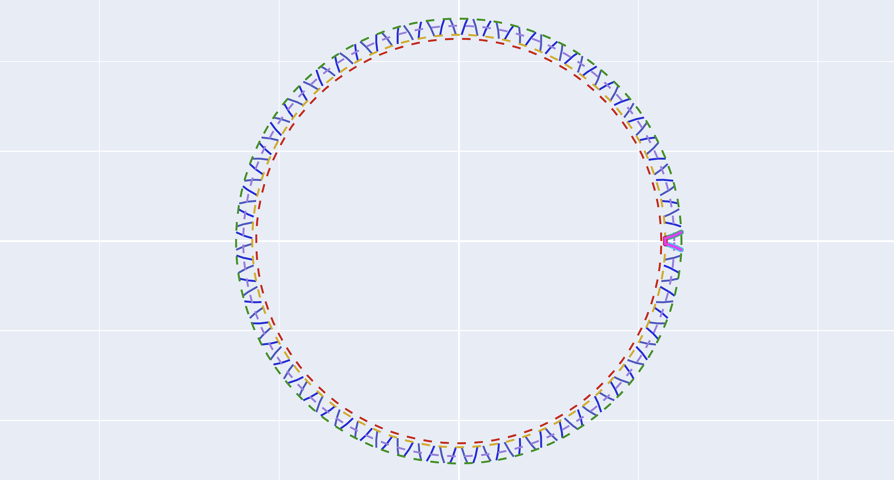

# 齿轮渐开线

用于生成标准或变位渐开线齿轮的法向齿形。

## 1. 齿轮类型

* **选项**: 可选择`渐开线齿轮`或`渐开线花键`。

## 2. 法向模数

* **单位**: $mm$

## 3. 齿数

## 4. 法向压力角

* **单位**: $°$
* **修正**: 支持对左/右侧法向压力角进行独立修正。

## 5. 螺旋角 (Beta)

* **单位**: $°$

## 6. 变位系数

* **修正**: 支持对变位系数进行微调。

## 7. 齿厚系数

* **标准值**: $0.5$。
* **修正**: 支持对齿厚进行修正。

## 8. 齿高模式

* **选项**: `设置直径` 或 `设置系数`。

## 9. 齿高参数

* **若选择设置直径**: 输入 `齿顶圆直径 (da)` 和 `齿根圆直径 (df)`。
* **若选择设置系数**: 输入 `齿顶高系数 (ha)` 和 `顶隙系数 (c)`。

## 10. 修整延长

* **说明**: 在齿形末端增加的修整长度。
* **单位**: $mm$

## 11. 齿顶圆弧半径

* **说明**: 定义左/右齿顶处的倒圆半径。
* **单位**: $mm$

## 12. 保存文件

* **操作**: 点击“选择文件”设置生成的 DXF 文件保存路径。

---

