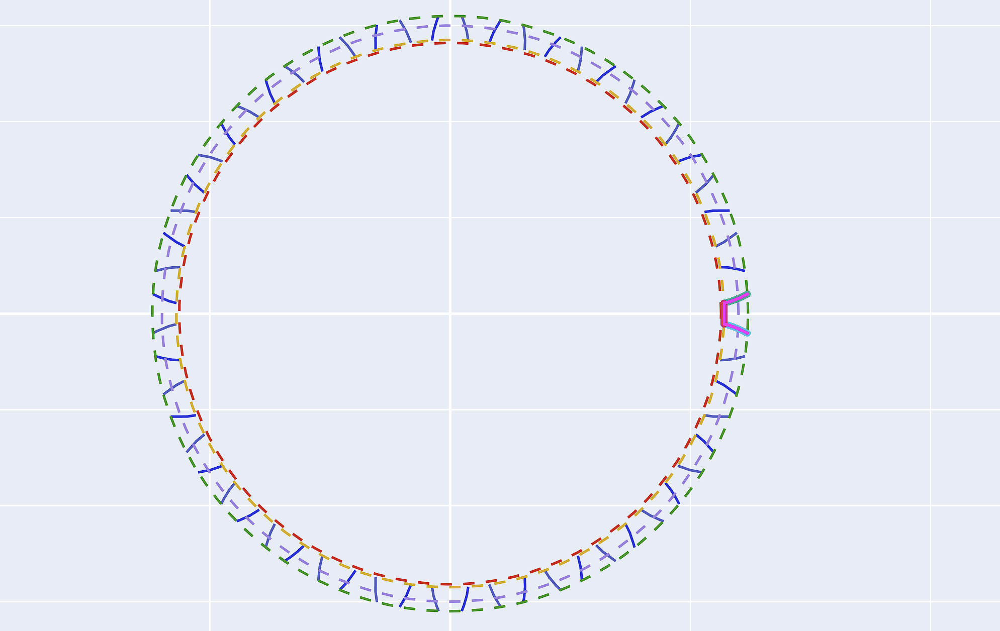

# 花键渐开线

用于生成渐开线花键的法向齿形。该功能与“齿轮渐开线”共用同一界面，只需在“类型”中切换即可。

## 1. 模数 / 齿数 / 压力角

* **说明**: 按照花键标准输入参数。
* **压力角修正**: 支持对左/右侧压力角进行独立修正。

## 2. 螺旋角 (Beta)

* **单位**: $°$ (对于直齿花键，设为 0)。

## 3. 变位系数 / 齿厚系数

* **修正**: 支持对变位和齿厚进行微调，以满足配合间隙要求。

## 4. 齿高模式与参数

* **说明**: 同齿轮渐开线设置，支持通过直径或系数定义齿高。

## 5. 修整延长 / 齿顶圆弧半径

* **单位**: $mm$

## 6. 保存文件

---

