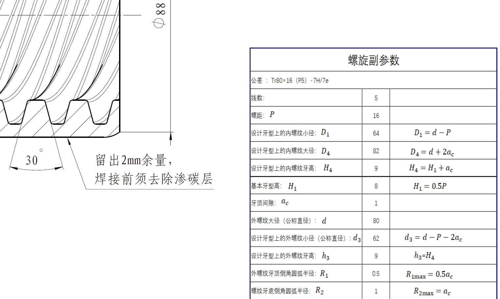

# 梯形

典型齿型图纸：

---

## 梯形齿型参数详解

此工具用于生成标准梯形齿型的DXF文件。各参数说明如下：

### 1. 工件小径/中径/大径/螺距
- **定义**：根据图纸或实际测量填写。

### 2. 右半角
- **定义**：齿型右侧与中轴线的夹角（单位：度）。**约定水平修整轴的负向对应齿型右侧。**
- **用途**：影响齿型的斜度和受力方向，常见标准为15°、20°等。

### 3. 右半角修正
- **定义**：对右半角的微调修正值（单位：度）。
- **用途**：用于补偿加工或设计误差，输入正负值均可。

### 4. 左半角
- **定义**：齿型左侧与中轴线的夹角（单位：度）。**约定水平修整轴的正向对应齿型左侧。**
- **用途**：与右半角类似，影响齿型对称性和受力。

### 5. 左半角修正
- **定义**：对左半角的微调修正值（单位：度）。
- **用途**：用于补偿加工或设计误差，输入正负值均可。

### 6. 齿顶圆弧半径 (左/右)
- **定义**：在梯形齿顶两端设置的圆弧半径。
- **说明**：可分别设置左右两侧的数值。

### 7. 保存文件
- **定义**：生成的DXF文件保存路径。
- **用途**：指定文件保存位置，便于后续查找和使用。
