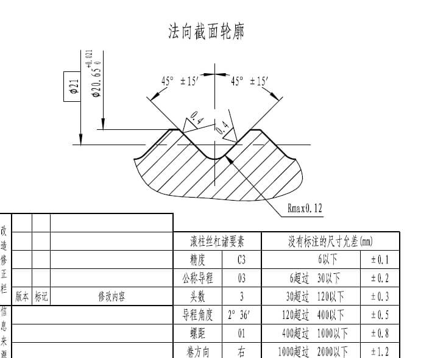

# 三角

典型齿型图纸：

---

## 三角齿型参数详解

此工具用于生成标准三角齿型的DXF文件。各参数说明如下：

### 1. 工件小径/工件中径/工件大径/工件螺距
- **定义**：根据图纸或实际测量填写。

### 2. 右半角
- **定义**：齿型右侧与中轴线的夹角（单位：度）。**约定水平修整轴的负向对应齿型右侧。**
- **用途**：影响齿型的斜度和受力方向，常见标准为30°、45°等。

### 3. 右半角修正
- **定义**：对右半角的微调修正值（单位：度）。
- **用途**：用于补偿加工或设计误差，输入正负值均可。

### 4. 左半角
- **定义**：齿型左侧与中轴线的夹角（单位：度）。**约定水平修整轴的正向对应齿型左侧。**
- **用途**：与右半角类似，影响齿型对称性和受力。

### 5. 左半角修正
- **定义**：对左半角的微调修正值（单位：度）。
- **用途**：用于补偿加工或设计误差，输入正负值均可。

### 6. 齿顶圆弧半径
- **定义**：在三角齿尖处设置的圆弧倒角半径。
- **用途**：用于避免应力集中或符合特定的密封/安装要求。

### 7. 保存文件
- **定义**：生成的DXF文件保存路径。
- **用途**：指定文件保存位置，便于后续查找和使用。

---

## 操作说明

1. 按照实际需求填写各参数。
2. 点击"选择文件"可自定义保存路径。
3. 填写完成后，点击"生成齿形文件"按钮，即可生成对应的DXF文件。

---

如需进一步了解每个参数的工程意义或标准推荐值，请参考相关机械设计手册或齿轮设计标准。

