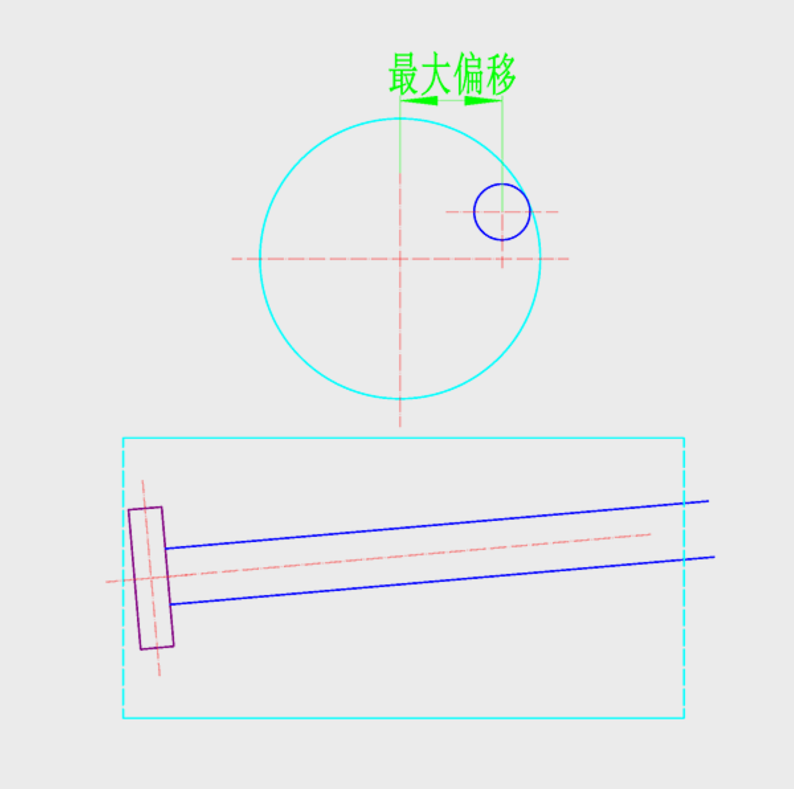

# 最大偏移计算
 
用于计算砂轮杆在不干涉工件的情况下，允许偏离工件中心的最大理论距离。
 
## 1. 工件加工长度
 
* **说明**: 指工件实际需要加工的总长度。
* **单位**: $mm$
 
## 2. 工件小径
 
* **说明**: 指工件的最小直径（底径）。
* **单位**: $mm$
 
## 3. 砂轮杆直径
 
* **说明**: 指用于安装砂轮的连杆直径。
* **单位**: $mm$
 
## 4. 砂轮杆安装角
 
* **说明**: 指砂轮杆在机床上的实际安装偏转角度。
* **单位**: $°$
 
## 5. 理论最大偏移
 
* **说明**: 点击“计算”后，系统根据上述几何关系自动得出的最大允许偏移距离。
 
---
 

