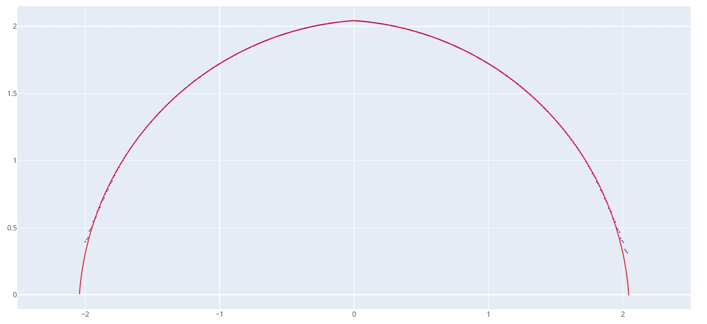
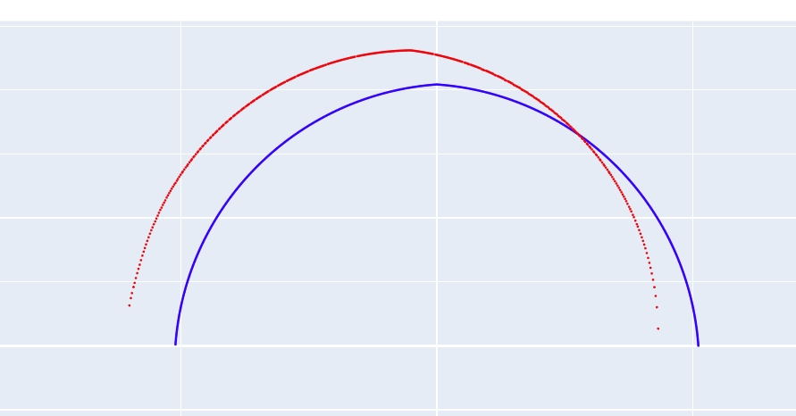
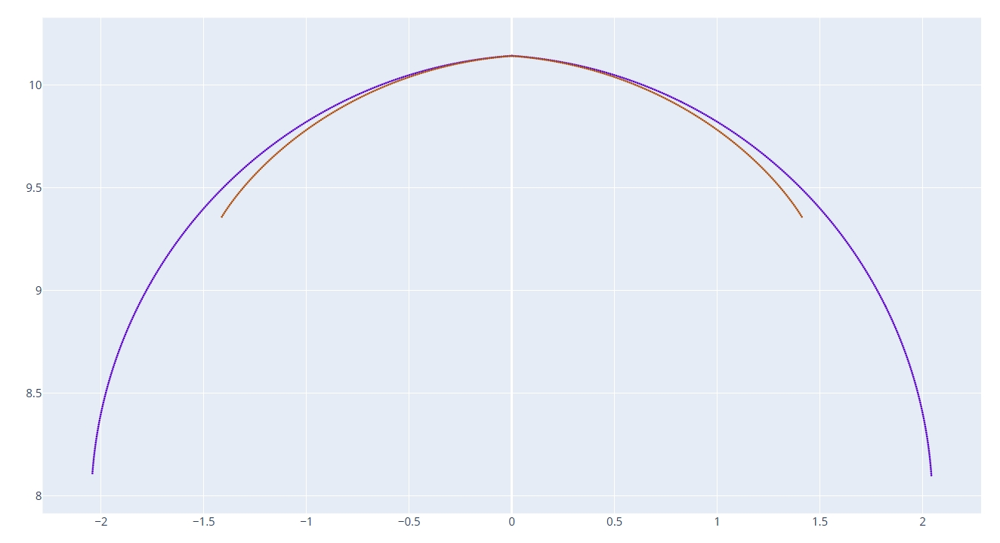

# 滚道计算
 
用于模拟在特定加工条件下（如干涉磨削、砂轮杆偏移等），实际加工出来的工件滚道法向截形。
 
## 1. 参数设置
 
* **工件类型**: `内螺纹` 或 `外螺纹`。
* **工件大径 / 中径 / 导程**: 定义工件的基本几何尺寸。
* **砂轮直径 / 安装角**: 定义当前的加工状态。
* **砂轮杆左右偏移**: 模拟砂轮杆长度误差（过长或过短）对滚道的影响。
    * **正值**: 砂轮偏左。
    * **负值**: 砂轮偏右。
* **砂轮修整齿型**: 导入计算出的砂轮修整轨迹文件（DXF）。
 
## 2. 核心功能
 
### 模拟干涉磨削影响
通过计算，可以预判干涉磨削导致的过切区域。如下图所示，干涉磨削可能导致滚道两侧边沿区域多磨：
 

 
### 模拟安装偏心影响
设置“砂轮杆左右偏移”可以模拟砂轮不在工件回转中心时的情况。例如，当偏移 10mm 时，滚道将出现明显的左右不对称（一侧多磨，一侧少磨）：
 

 
---
 

