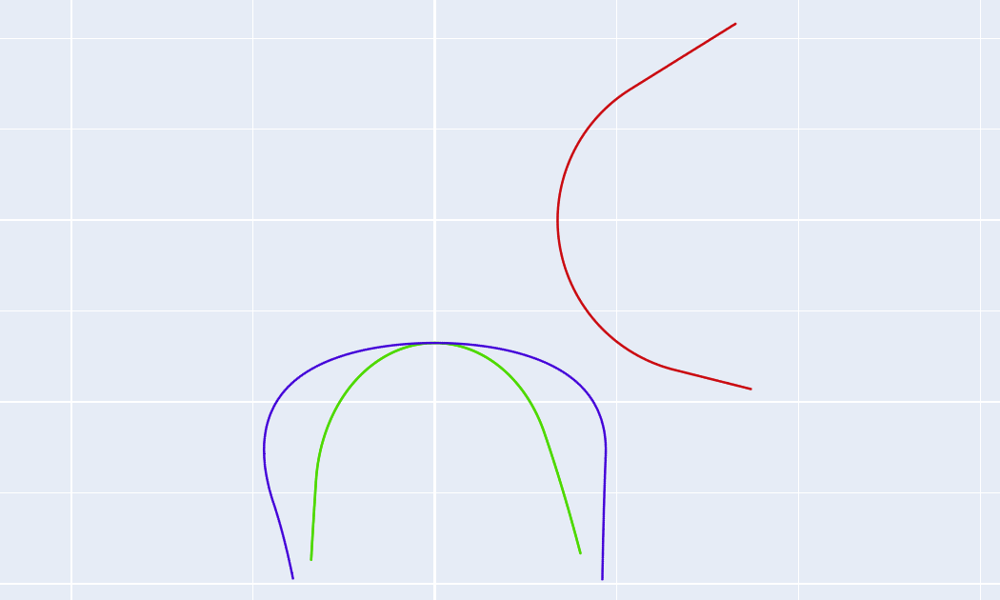

# 曲线转换
 
用于在法向、轴向和端面齿型曲线之间进行相互转换。
 
## 1. 原始与目标曲线类型
 
* **法向 (Normal)**: 垂直于螺旋线的截面齿型。要求原点 $(0,0)$ 对应在**工件中径**位置上。
* **轴向 (Axial)**: 沿工件轴线方向的截面齿型。要求原点 $(0,0)$ 对应在**工件中径**位置上。
* **端面 (Transverse)**: 垂直于工件轴线的截面齿型。要求原点 $(0,0)$ 对应在**工件中心**上。
 
## 2. 工件参数
 
* **工件类型**: `内螺纹` / `外螺纹`。
* **工件中径 / 导程**: 根据工件参数输入。
 
## 3. 文件操作
 
* **原始曲线文件**: 导入符合坐标系要求的 DXF 文件。
* **保存文件**: 生成转换后的目标曲线 DXF 文件。
 
---
 

