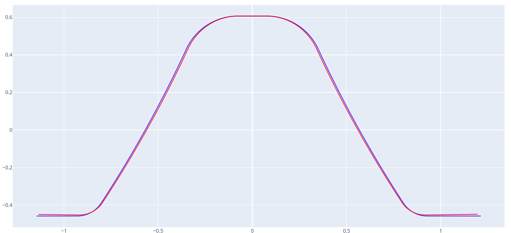
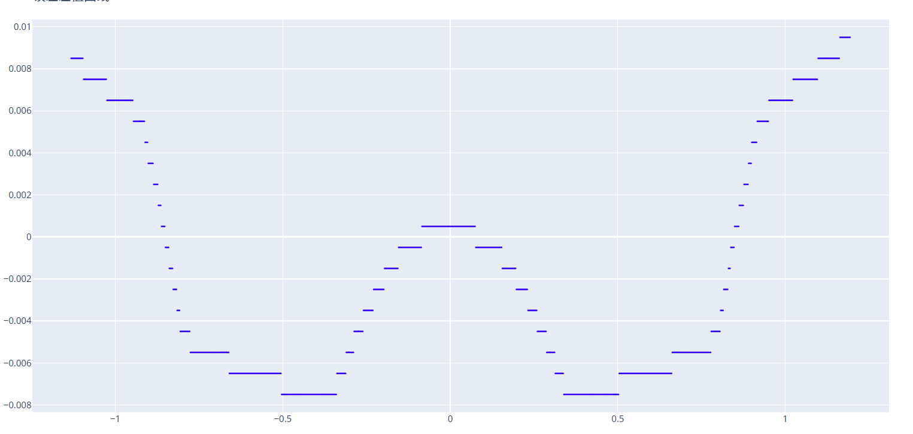

# 曲线误差对比
 
通过输入 DXF 格式的基准曲线文件和对比曲线文件，软件自动分析基准曲线上每一点和对比曲线之间的误差值。
 
## 1. 曲线 1 (基准)
 
* **说明**: 输入基准曲线的 DXF 文件。
* **计算逻辑**: 误差数据是基准曲线上每一点在其法线方向上与对比曲线的距离。误差在 Y 轴正向则值为正，反之为负。
 
## 2. 曲线 2 (对比)
 
* **说明**: 输入对比曲线的 DXF 文件。
 
## 3. 最大检测距离
 
* **说明**: 设置检测误差时的搜索范围。应尽量设置得小一些（只要能覆盖最大预期误差即可），以防止误检测到曲线的其他远端部分。
 
## 4. 曲线方向
 
* **选项**: `X 轴` / `Y 轴`
* **说明**: 设置曲线的主要走向，以辅助算法识别。
 
---
 
### 示例
 
两条曲线的重叠对比：

 
分析生成的误差分布曲线（显示了沿曲线每一点的详细误差值）：

