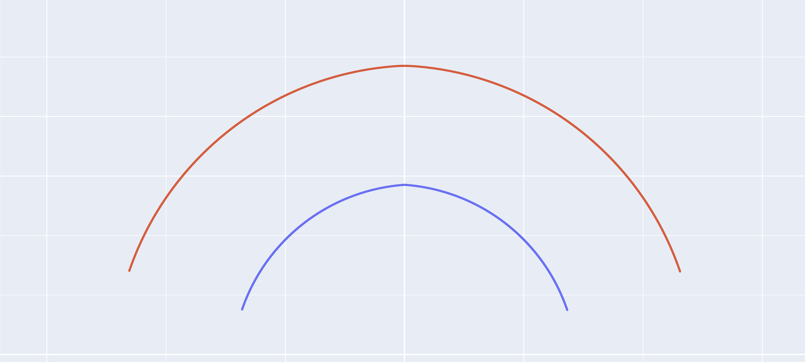

# DXF 等距线
 
用于为给定的 DXF 曲线生成指定宽度的等距（偏移）曲线。
 
## 1. DXF 文件
 
* **说明**: 输入需要进行偏移处理的原始曲线 DXF 文件。
 
## 2. 等距宽度
 
* **说明**: 设置偏移的距离值。
* **单位**: $mm$
 
## 3. 等距方向
 
* **选项**: `曲线外侧` / `曲线内侧`
* **说明**: 选择偏移的方向。
 
## 4. 保存文件
 
* **说明**: 点击按钮后，生成偏移后的 DXF 曲线文件。
 
---
 

