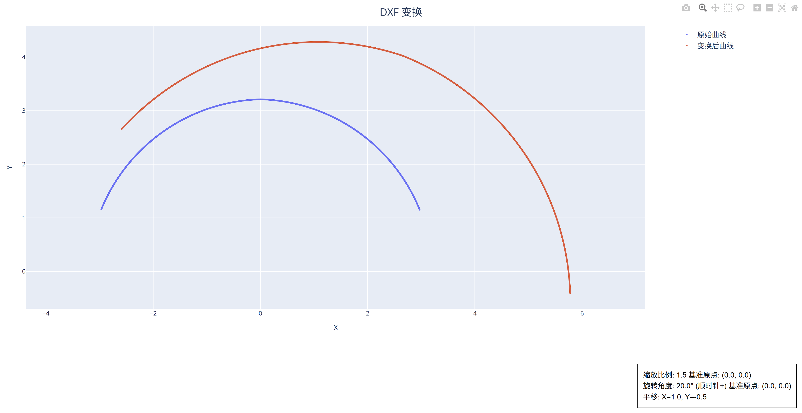

# DXF 变换
 
用于对给定的 DXF 曲线进行缩放/旋转/平移变换。
 
## 1. DXF 文件
 
* **说明**: 输入需要进行变换处理的原始曲线 DXF 文件。
 
## 2. 缩放比例
 
* **说明**: 设置缩放的比例值。
* **单位**: 设置为1表示原始图形，小于1表示缩小，大于1表示放大。

### 2.1 缩放基准 X
* **说明**: 设置缩放的基准点 X 坐标。

### 2.2 缩放基准 Y
* **说明**: 设置缩放的基准点 Y 坐标。

## 3. 旋转角度
 
* **说明**: 设置旋转的角度值。
* **单位**: 设置为0°表示原始图形，小于0°表示逆时针旋转，大于0°表示顺时针旋转。

### 3.1 旋转基准 X
* **说明**: 设置旋转的基准点 X 坐标。

### 3.2 旋转基准 Y
* **说明**: 设置旋转的基准点 Y 坐标。

## 4. 平移距离

### 4.1 平移距离 X
* **说明**: 设置平移的距离值。
* **单位**: $mm$

### 4.2 平移距离 Y
* **说明**: 设置平移的距离值。
* **单位**: $mm$

---
 

