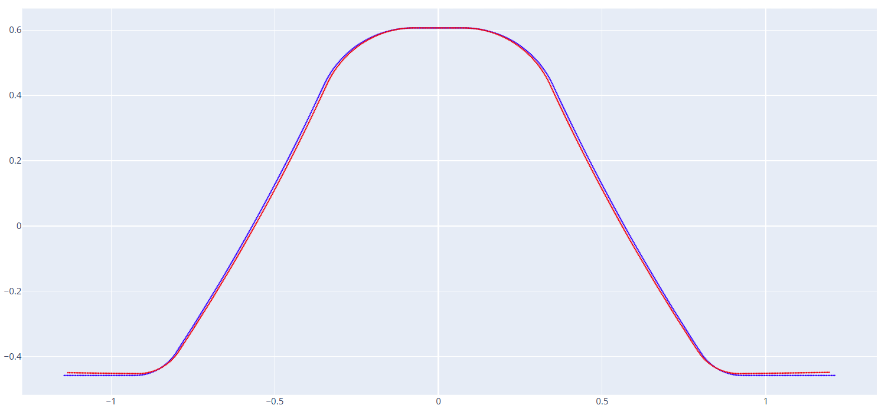
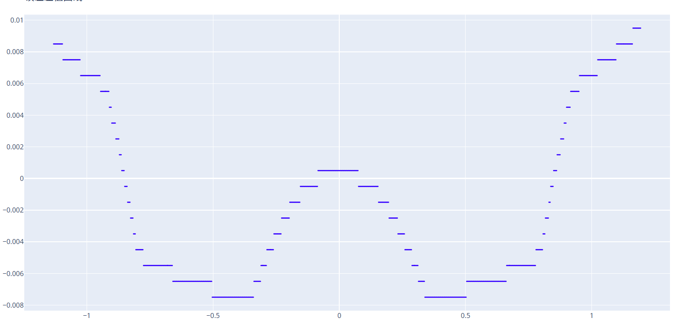

# 曲线误差对比

通过输入DXF格式的基准曲线文件和对比曲线文件，软件自动分析基准曲线上每一点和对比曲线之间的误差值。

## 曲线 1 (基准)

输入基准曲线的 DXF 文件。

误差数据为基准数据上每一点的法线方向和对比曲线的误差距离，误差方向在Y轴正向则误差值为正，反之为负。

## 曲线 2 (对比)

输入对比曲线的 DXF 文件。

## 保存文件

生成的误差数据曲线文件为 DXF 格式。

---

以下是两条曲线的对比：

他们的误差数据曲线：

