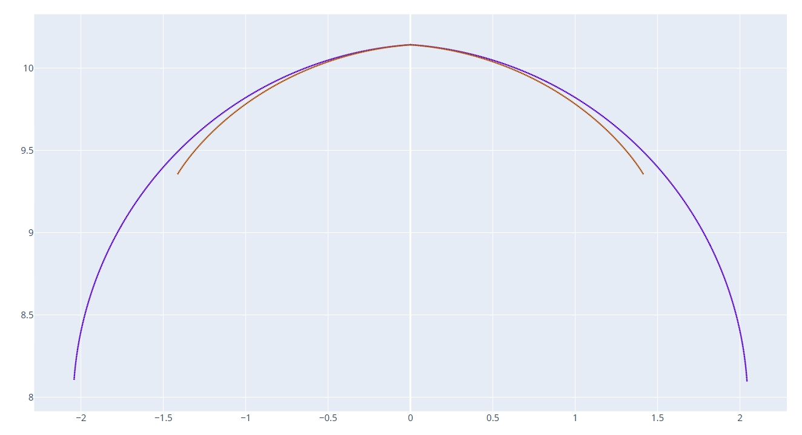
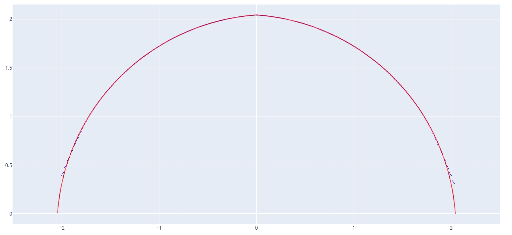
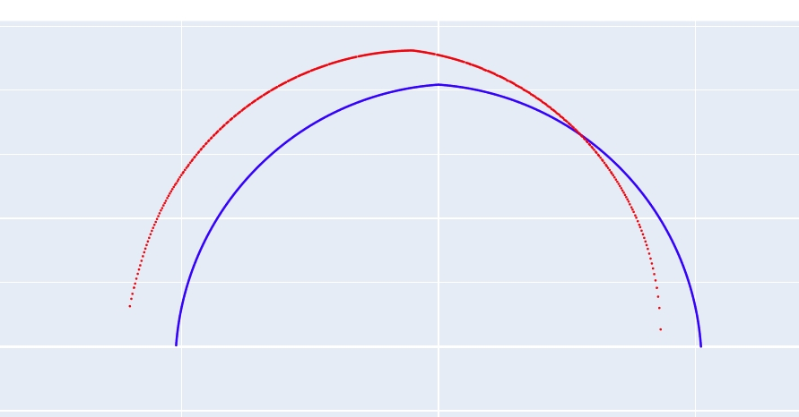

# 滚道曲线计算

此工具通过输入修整齿型文件，加工时安装角，砂轮直径，工件实际大径和砂轮杆左右偏移等相关参数，生成实际加工出来的滚道法向截形。此工具主要用于提前判断加工出的滚道形状是否符合预期，以进行对应参数调整。同时可以模拟砂轮杆过长或过短对齿型会产生怎样的影响。

---

## 参数设置

1. **工件类型**
   - 选择工件的类型，可选"内螺纹" 和 "外螺纹"。

2. **工件大径**
   - 输入工件的最大外径，单位为毫米（mm）。该参数用于确定工件的外部尺寸。

3. **工件中径**
   - 输入工件的中径，单位为毫米（mm）。中径通常用于螺纹等结构的几何计算。
   - 此参数用于计算标准螺旋升角。

4. **导程**
   - 输入工件的导程，单位为毫米（mm）。导程是指螺纹每转一圈轴向移动的距离。
   - 此参数用于计算标准螺旋升角。

5. **砂轮直径**
   - 输入砂轮的直径，单位为毫米（mm）。该参数影响砂轮与工件的接触关系。

6. **砂轮安装角**
   - 输入砂轮的安装角度，单位为度（°）。此参数右侧显示的是工件标准螺旋升角。
   - 如果是干涉磨削砂轮安装角则输入数据和标准螺旋升角不一样。

7. **砂轮杆左右偏移**
   - 输入砂轮杆的左右偏移量，单位为毫米（mm）。用于调整砂轮在加工时的横向位置。
   - 如果砂轮在标准回转中心上，则偏移为 0。
   - 如果砂轮杆过长，即砂轮在回转中心左侧，则输入正值。反之则输入负值。

8. **砂轮修整类型**
   - 输入砂轮修整文件路径。砂轮修整曲线需要齿顶最高点在坐标系原点。

9. **保存文件**
   - 设置生成的工件截面曲线文件的保存路径，通常为DXF格式。

10. **生成工件截面曲线**
    - 点击此按钮，根据以上参数生成工件的截面曲线文件。

## 实际应用

### 干涉磨削

对于干涉磨削，砂轮和滚道接触线包含异常区域，通常会舍弃这部分，从而导致在实际加工中在滚道部分区域会偏离标准轨迹。

通过此工具可以模拟实际加工出来的滚道到底是什么样子的，以及误差区域是否会影响工件品质以及检验要求。

以下是一个双圆弧齿型标准螺旋角为 8.29 度的工件，砂轮杆在 3 度情况下加工时的砂轮轨迹和标准轨迹对比：

打开 **plot_contour_curve.html** 文件可以查看特定砂轮直径下的工件大径等数据：

将数据输入 **Interference Grinding Dressing** 的**滚道曲线计算**工具中，**砂轮修整齿型**文件导入输出文件夹中的 **dxf_dress_wheel_curve_xxxxx.dxf** 文件，点击**生成工件截面曲线**按钮输出实际加工的滚道形状，然后通过 DXF 工具和标准滚道曲线进行对比：

可以看到轨迹大部分区域都是和标准吻合的，在截面两侧区域，干涉磨削会导致多磨。

### 砂轮杆偏移

通过设置砂轮杆左右偏移参数，可以模拟砂轮不在回转中心时会对滚道参数什么样的影响。

以下结果是砂轮杆偏移设置为 `10` 时，滚道轨迹和标准轨迹对比情况：

可以看到滚道左侧区域会多磨，右侧区域会少磨。

以上就是滚道曲线计算的使用方法。
