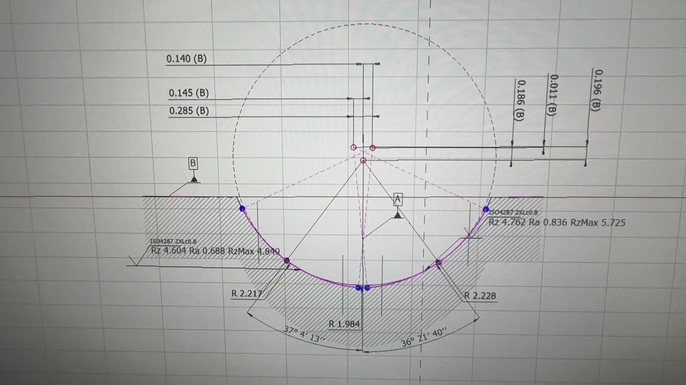
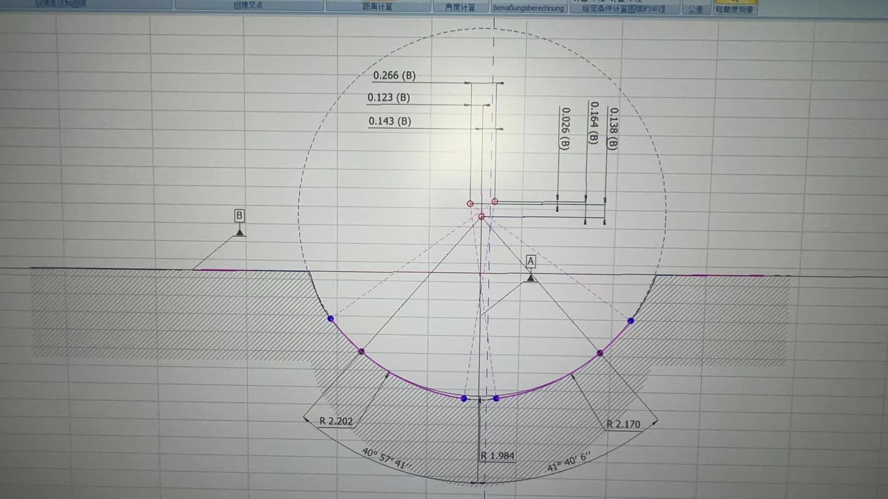

# 齿型误差

通过测量仪对加工齿槽进行精确测量，根据测量报告和工件图纸进行比对，调整齿型相关数据，然后重新生成修整代码再次试磨工件。这个过程就是常规的齿型误差补偿过程。

绘图工具中的标准齿型：三角/梯形/双圆弧，都可以对角度或圆弧大小进行微调。

## 示例

以下是对钢球直径3.969mm，接触角42度的工件进行干涉磨削后的测量结果如下：

工件标准圆弧半径为 `2.203`。可见左右圆弧半径都偏大。

通过双圆弧绘制工具，对左右圆弧分别减少对应差值后再次加工，测量结果如下：

补偿后基本符合图纸公差要求。
