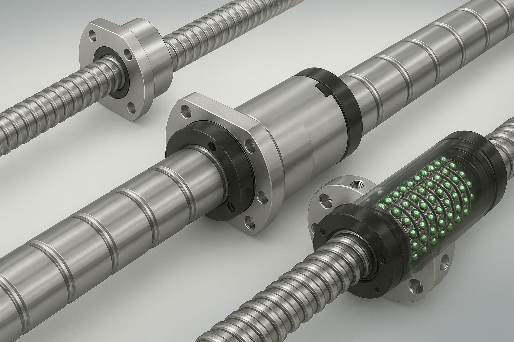

# 齿型绘制

本章介绍如何使用 **Interference Grinding Dressing** 绘制齿型，以便于后续的加工和管理。该软件提供多种齿型绘制并输出 DXF 格式文件，满足不同场景下的需求。

**Interference Grinding Dressing** 支持绘制以下几种齿型：

1. **三角/梯形/双圆弧**
    - 应用最广泛的丝杆和螺母的齿型。
    - 通过输入标准的齿型信息即可输出对应齿型文件。
    - 输出的齿型文件是以中径线为基准原点。

1. **XY 点位文件**
    - 适用于使用三坐标测量仪测绘齿型并输出的原始坐标数据。
    - 通过读取测量得到的 XY 坐标点，自动生成齿型轮廓。
    - 适合用于已有工件实物的逆向工程。
    - 可用于将任何XY点位格式的数据转换为 DXF 文件。

2. **渐开线**
    - 可生成渐开线齿轮和渐开线蜗杆的标准齿型。

下面将详细介绍每种方式的使用方法及其适用场景。

