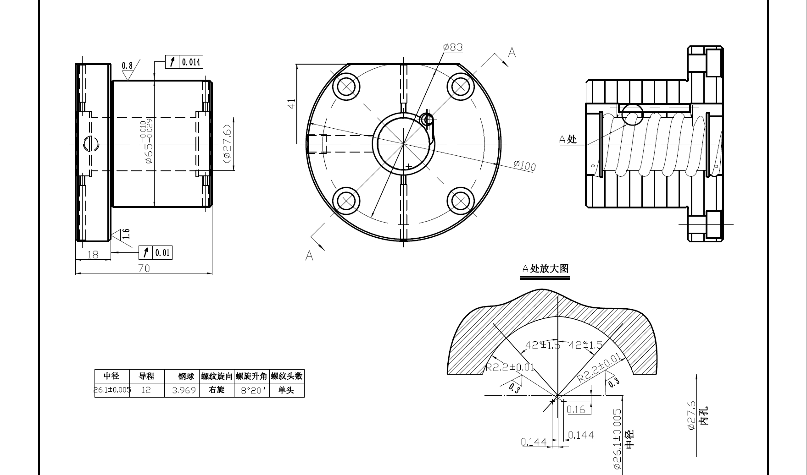

# 双圆弧

典型齿型图纸：

---

## 双圆弧齿型参数详解

此工具用于生成标准双圆弧齿型的DXF文件。各参数说明如下：

### 1. 计算系数
- **定义**：钢球直径与圆弧半径的比例系数。常见值有 1.11 和 1.08。
- **作用**：用于确定齿型设计时，钢球直径与圆弧半径之间的关系。不同的系数对应不同的齿型标准，需根据实际工艺或标准选择。

### 2. 钢球直径
- **定义**：用于齿型计算的基准钢球的直径。
- **作用**：通常用于测量齿型中性线或作为齿型设计的参考尺寸。直接影响齿型的几何参数。

### 3. 接触角
- **定义**：齿型与中轴线的夹角（单位：度）。
- **作用**：决定齿型的倾斜程度，影响齿轮啮合时的受力方向和传动效率。常见标准有 38°、45°等。

### 4. 右圆弧半径
- **定义**：齿型右侧圆弧的半径。
- **作用**：决定右侧齿形的曲率，影响齿型的啮合特性和强度。

### 5. 右水平偏心
- **定义**：右侧圆弧圆心相对于理论中心的水平方向偏移量。
- **作用**：用于微调齿型对称性或补偿加工误差。

### 6. 右垂直偏心
- **定义**：右侧圆弧圆心相对于理论中心的垂直方向偏移量。
- **作用**：同样用于微调齿型对称性或补偿加工误差。

### 7. 左圆弧半径
- **定义**：齿型左侧圆弧的半径。
- **作用**：决定左侧齿形的曲率，影响齿型的啮合特性和强度。

### 8. 左水平偏心
- **定义**：左侧圆弧圆心相对于理论中心的水平方向偏移量。
- **作用**：用于微调齿型对称性或补偿加工误差。

### 9. 左垂直偏心
- **定义**：左侧圆弧圆心相对于理论中心的垂直方向偏移量。
- **作用**：同样用于微调齿型对称性或补偿加工误差。

### 10. 计算/反算
- **计算**：根据输入的参数，自动计算出齿型的各项几何参数。
- **反算**：根据已知的齿型参数，反推输入参数，便于校核或修正设计。

### 11. 保存文件
- **定义**：生成的DXF文件保存路径。
- **作用**：指定生成的齿型文件（DXF格式）的保存位置，便于后续查找和使用。

### 12. 选择文件
- **作用**：用于选择或更改DXF文件的保存路径。

### 13. 生成齿形文件
- **作用**：点击后，根据填写的参数生成对应的齿型DXF文件。

---

如需进一步了解每个参数的工程意义或标准推荐值，可参考机械设计手册或齿轮设计标准。

