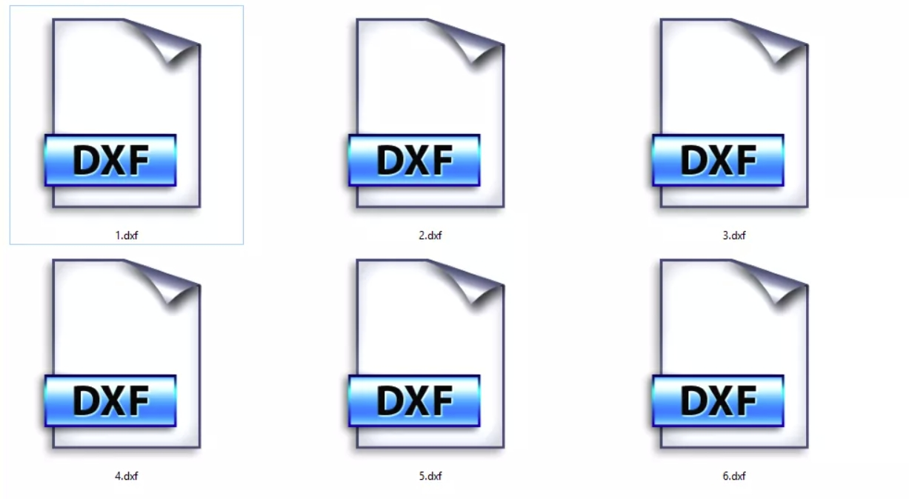

# DXF 工具

**Interference Grinding Dressing** 的大部分对于文件的操作都是基于 DXF 格式的，为了方便操作，**Interference Grinding Dressing** 内置了一系列 DXF 文件处理工具，包含以下功能：

- **DXF 对比**：将多个 DXF 文件叠放在一起观察他们的区别。
- **DXF 离散化**：将 DXF 文件转换为离散点化的 DXF 文件。
- **DXF 拟合圆弧**：将离散点化的 DXF 文件转换为拟合圆弧的 DXF 文件。
