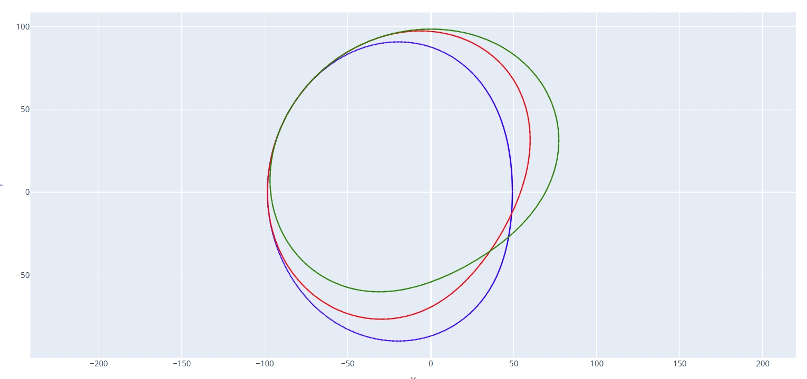

# DXF 对比

输入最多 3 个 DXF 文件，将他们叠放在一起观察他们的区别。如果只有两个文件需要对比，可以将其中一个文件同时输入两个输入框中。

## DXF 文件 1

输入第一个 DXF 文件。

## DXF 文件 2

输入第二个 DXF 文件。

## DXF 文件 3

输入第三个 DXF 文件。

## DXF 保存地址

选择叠加后的 DXF 文件保存路径。同时会输出 html 格式文件。

---

输出效果示例：
