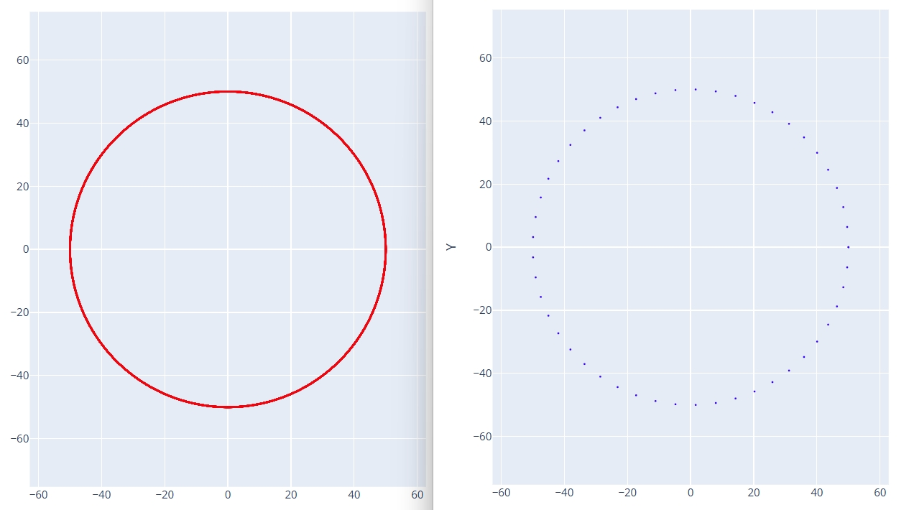
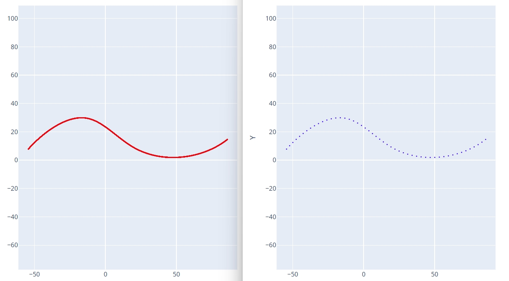
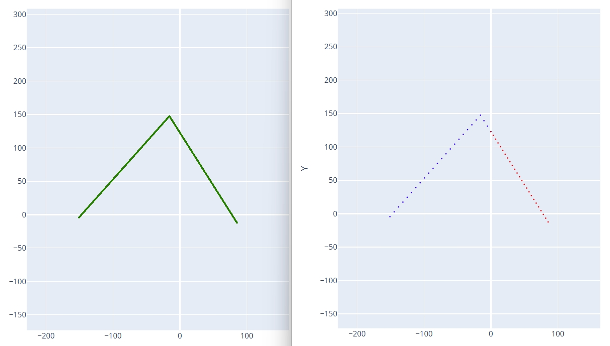
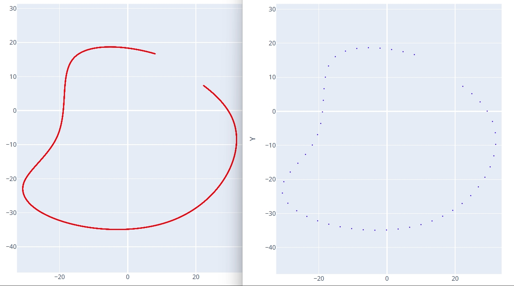

# DXF 离散化

将一个连续的曲线打散为指定数量的等距离散点，曲线构成可以是直线/圆弧/样条曲线/多段线等形式。

## 曲线 DXF 文件

输入一个连续曲线构成的 DXF 文件，可以是直线/圆弧/样条曲线/多段线等形式。

## 最终曲线颠密度

设置离散点个数，点与点之间是等距的。

## 曲线方向

根据曲线的实际样式和需求，设置曲线离散化方向，可选类型有：
- **顺时针 - X 轴 +**：以 X 轴正向坐标轴为基准，按照顺时针方向离散化。一般用于顺时针方向的连续曲线。
- **逆时针 - X 轴 +**：以 X 轴正向坐标轴为基准，按照逆时针方向离散化。一般用于逆时针方向的连续曲线。
- **升序 - X 轴**：以 X 轴坐标为基准，从小到大离散化曲线。
- **降序 - X 轴**：以 X 轴坐标为基准，从大到小离散化曲线。
- **拆分 - Y 轴**：以 Y 轴坐标轴为分隔线，左边按照 X 轴坐标由大到小离散化，右边按照 X 轴坐标由小到大离散化。
- **自动识别** - 自动查找曲线的端点并沿着端点方向将整个曲线离散化。

选择不合适的曲线方向可能导致离散化后的曲线和原始曲线不一致。

在设置曲线方向的基础上，可选**反向排序**离散点。主要影响离散化后的 TXT 点位坐标文件中点的排序。

点击`生成离散化数据`按钮后会生成离散化后的曲线 DXF 文件和 html 文件，以及离散化后的 TXT 点位坐标文件。

---

## 示例

顺时针/逆时针离散化曲线对比：

升序/降序离散化曲线对比：

拆分Y轴离散化曲线对比：

自动识别离散化曲线对比：

