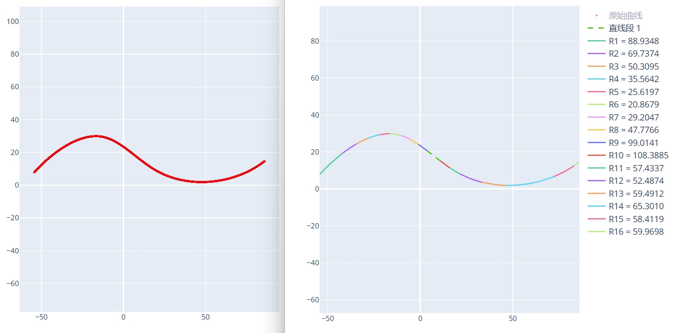

# DXF 拟合圆弧

将一条连续或者离散点构成的曲线转换为拟合多个圆弧段构成的曲线。

## 曲线 DXF 文件

输入一个连续曲线构成的 DXF 文件，可以是直线/圆弧/样条曲线/多段线构成的连续曲线，也可以是离散点构成的曲线。

## 拟合误差

拟合误差参数用于控制圆弧拟合的精度。设置值越小，拟合结果越接近原始曲线，精度越高，但同时会增加圆弧段的数量。通常情况下，建议将该参数设置为 1，以达到精度与效率的平衡。

## 曲线方向

根据曲线的实际样式和需求，设置曲线圆弧拟合方向，可选类型有：
- **顺时针 - X 轴 +**：以 X 轴正向坐标轴为基准，按照顺时针方向拟合圆弧。一般用于顺时针方向的曲线。
- **逆时针 - X 轴 +**：以 X 轴正向坐标轴为基准，按照逆时针方向拟合圆弧。一般用于逆时针方向的曲线。
- **升序 - X 轴**：以 X 轴坐标为基准，从小到大拟合圆弧。
- **降序 - X 轴**：以 X 轴坐标为基准，从大到小拟合圆弧。
- **拆分 - Y 轴**：以 Y 轴坐标轴为分隔线，左边按照 X 轴坐标由大到小拟合圆弧，右边按照 X 轴坐标由小到大拟合圆弧。
- **自动识别** - 自动查找曲线的端点并沿着端点方向将整个曲线拟合。

选择不合适的曲线方向可能导致拟合圆弧后的曲线和原始曲线不一致。

在设置曲线方向的基础上，可选**反向排序**。主要影响拟合圆弧后的 TXT 中的圆弧段的顺序，以及生成的程序中圆弧顺序。

点击`生成拟合数据`按钮后会生成圆弧拟合后的曲线 DXF 文件和 html 文件，以及记录每个圆弧坐标信息的 TXT 文件和 CNC 加工程序代码文件。

---

## 示例

原始曲线和拟合圆弧后的曲线示例图：


圆弧信息 TXT 文件内容：
```
拟合圆弧段信息

直线段:
第 1 段 - 直线段起点坐标: [3.8364, 20.5940], 直线段终点坐标: [10.6987, 15.2382]

圆弧段:
第 1 段 - 标准起点坐标: [-54.3202, 7.7987], 标准终点坐标: [-41.9398, 19.3409], 平滑起点坐标: [-54.3203, 7.7988], 平滑终点坐标: [-41.9378, 19.3383]
          圆弧半径: 88.9348, 圆心坐标: [12.2406, -51.1848], 圆弧相对圆心角度范围: [138.4539, 127.5328]
第 2 段 - 标准起点坐标: [-41.9361, 19.3360], 标准终点坐标: [-34.3680, 24.4060], 平滑起点坐标: [-41.9378, 19.3383], 平滑终点坐标: [-34.3665, 24.4034]
          圆弧半径: 69.7374, 圆心坐标: [0.5787, -35.9433], 圆弧相对圆心角度范围: [127.5635, 120.0740]
第 3 段 - 标准起点坐标: [-34.3650, 24.4008], 标准终点坐标: [-27.8279, 27.5831], 平滑起点坐标: [-34.3665, 24.4034], 平滑终点坐标: [-27.8268, 27.5803]
...
```

CNC 加工程序代码内容：
```
G01 X=-54.3203 Y=7.7988
G03 X=-41.9378 Y=19.3383 CR=88.9348
G03 X=-34.3665 Y=24.4034 CR=69.7374
G03 X=-27.8268 Y=27.5803 CR=50.3095
G03 X=-21.9768 Y=29.3527 CR=35.5642
...
```
