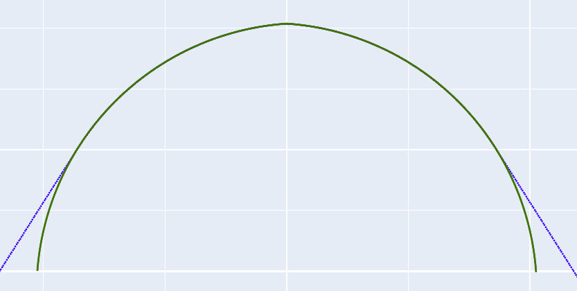
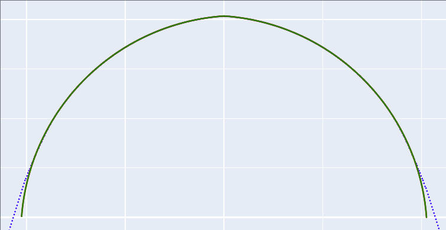
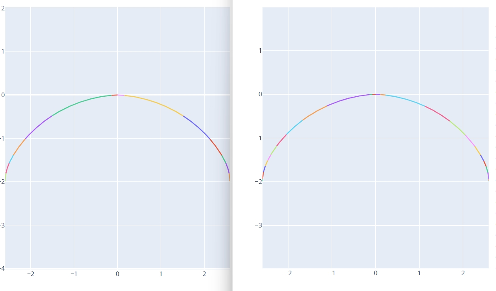
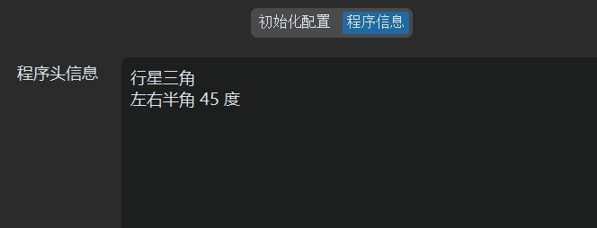

# 高级参数 - 初始化配置

本节介绍初始化配置中的高级选项。用户可根据具体加工需求调整这些参数，以进一步优化加工过程、提升最终精度。

## 滚轮圆弧半径

* **定义**: 设置修整器上安装的滚轮（或触笔）尖端的圆弧半径。
* **单位**: $mm$
* **说明**: 机床实际执行的修整轨迹是目标砂轮齿型轮廓线按此半径值进行的等距偏置线。通常情况下，**滚轮圆弧半径越小**，越有可能精确地修整出形状更复杂的砂轮齿型。

## 最终曲线点密度

* **定义**: 控制生成修整程序时，构成连续修整轨迹的离散点数量。
* **默认值**: $400$ 点
* **影响**:
    * **更高密度**: 提高轨迹精度，更逼近理论曲线。
    * **更低密度**: 减少代码行数，可能加快程序在机床上的执行速度。
* **权衡**: 请根据精度要求和机床性能选择合适的点密度。过高的密度会显著增加代码量并可能降低执行效率。

## 螺旋面生成角度

* **定义**: 软件内部在计算砂轮与工件滚道接触线时，动态生成一个滚道螺旋曲面的范围角度。
* **背景**: 当**砂轮安装角**与工件**标准螺旋升角**不一致（即干涉磨削）时，接触线会是一条复杂的空间曲线。角度差异越大，这条空间曲线在螺旋面上的分布范围越广。
* **设置**: 此参数定义了计算接触线时所考虑的螺旋面包络角度。
* **推荐**: **默认值 $90$ 度** 通常足以覆盖接触线的主要区域，一般无需修改。

## 切线延长长度

* **定义**: 在计算出的砂轮修整轨迹两端，沿切线方向额外增加一段延长线。
* **单位**: $mm$
* **目的**: 解决因砂轮直径变化导致所需修整宽度变化的问题。
* **场景**: 有时，直径较大的新砂轮所需的修整宽度反而可能*小于*直径变小后的旧砂轮。若不加延长，当砂轮磨损变小时，可能无法完整修整出所需形状的边缘部分。
* **作用**: 设置合理的切线延长长度，可以确保修整路径始终比实际需求稍宽，从而**防止砂轮变小后无法完整修整出所需轮廓**。

## 内收角度

* **定义**: 将切线延长线部分沿端点向内旋转的角度。
* **单位**: $°$
* **目的**: 优化滚道两侧边沿过切部分。
* **场景**: 对于双圆弧等齿型进行干涉加工时，滚道外侧边沿无法求的砂轮接触线部分默认修整一段切线延长线，加工出的滚道两侧边沿会产生过切部分。
* **作用**: 可以通过调整延长线的角度来优化过切部分面积。

以下是按照标准切线延长线延申修整砂轮后模拟加工出的滚道轮廓和标准滚道轮廓的对比图：


以下是将切线延长线向内旋转10度修整砂轮后模拟加工出的滚道轮廓和标准滚道轮廓的对比图：


可以看出向内旋转后加工出的滚道两侧边沿部分的过切部分面积降低了。

## 垂直延长长度

* **定义**: 在计算出的砂轮修整轨迹两端，沿近似垂直于齿型表面的方向增加一段延长轨迹。
* **单位**: $mm$
* **目的**: 解决干涉磨削中潜在的根部干涉问题。
* **场景**: 在干涉磨削设置下，砂轮轮廓的根部（靠近砂轮轴线的部分）有时可能会在加工时干涉到滚道的有效工作区域。
* **作用**: 增加一段垂直修整部分，可以将这部分**可能产生干涉的砂轮根部材料提前去除**，从而保证最终的加工精度。

## 计算灵敏度

* **定义**: 控制软件在计算滚道与砂轮接触线时的识别灵敏度。
* **影响**:
    * **值越小**: 识别精度越高，对接触点的要求更严格。
    * **值越大**: 识别范围放宽，容忍度更高。
* **权衡**:
    * 过小的值可能导致算法**无法找到足够的有效接触点**，进而无法生成修整轨迹。
    * 过大的值可能引入不精确的接触点，影响最终轮廓精度。
* **推荐**:
    * **设置值 $1$** 是一个相对平衡的选择，适用于多数情况。
    * 对于**外螺纹**加工，由于砂轮杆中心与工件中心距离通常较大，可能需要**适当增大**此值（例如 $5$ 或 $10$）才能成功计算出接触线。

## 拟合圆弧

* **功能**: 将计算出的离散点修整轨迹拟合为一系列 G02/G03 圆弧指令。
* **优点**:
    * **显著减少 G 代码行数**。
    * 提高程序在 CNC 系统上的**执行效率**和**平滑性**。
* **方法**: 启用后，系统采用**最小二乘法**算法进行圆弧拟合。
* **选项**:
    * **启用/禁用**: 控制是否执行圆弧拟合。
    * **G3/G2 反转**: 若机床坐标系定义或圆弧插补方向与标准不同（例如，垂直轴向上为负），可能需要勾选此项来交换 G02 和 G03 指令。
* **代码示例 (启用后)**:
    ```gcode
    ; G02/G03 指令替代了大量的 G01 线性插补指令
    G02 AX[AX_VER]=0.0104*VER_MODE AX[AX_HORI]=0.1664 CR=1.5149
    G02 AX[AX_VER]=0.3789*VER_MODE AX[AX_HORI]=1.3165 CR=2.9761
    G02 AX[AX_VER]=0.8107*VER_MODE AX[AX_HORI]=1.8929 CR=2.8071
    ; ... more G02/G03 commands ...
    ```
* **额外输出文件**: 启用圆弧拟合后，在输出目录的 `特定砂轮直径下加工运行轨迹` 子文件夹内会额外生成：
    ```
    特定砂轮直径下加工运行轨迹/
    ├── 圆弧拟合后 DXF 文件
    ├── 圆弧拟合后 HTML 文件
    └── 圆弧拟合后 TXT 文件
    ```
* **拟合数据 (TXT 文件)**: `圆弧拟合后 TXT 文件` 包含了详细的拟合信息，便于分析和验证，格式如下：
    ```text
    圆弧段:
    第 1 段 - 标准起点坐标: [0.0000, 0.0001], 标准终点坐标: [-0.1384, -0.0076], 平滑起点坐标: [0.0000, 0.0000], 平滑终点坐标: [-0.1384, -0.0074]
             圆弧半径: 1.2104, 圆心坐标: [-0.0027, -1.2103], 圆弧相对圆心角度范围: [89.8704, 96.4367]
    第 2 段 - 标准起点坐标: [-0.1384, -0.0075], 标准终点坐标: [-1.5076, -0.4804], 平滑起点坐标: [-0.1384, -0.0074], 平滑终点坐标: [-1.5075, -0.4805]
             圆弧半径: 3.0657, 圆心坐标: [0.1495, -3.0597], 圆弧相对圆心角度范围: [95.3890, 122.7188]
    第 3 段 - 标准起点坐标: [-1.5074, -0.4806], 标准终点坐标: [-2.1256, -1.0124], 平滑起点坐标: [-1.5075, -0.4805], 平滑终点坐标: [-2.1255, -1.0125]
             圆弧半径: 2.9302, 圆心坐标: [0.0758, -2.9463], 圆弧相对圆心角度范围: [122.7056, 138.7031]
    ...
    ```

## 拟合误差

* **定义**: 在启用**拟合圆弧**功能时，此参数控制拟合出的圆弧与原始离散点轨迹之间的最大允许偏差。
* **单位**: $mm$ (通常)
* **影响**:
    * **值越小**: 拟合精度越高（圆弧更贴近原始点），但生成的**圆弧段数量会增加**。
    * **值越大**: 拟合精度降低，但生成的圆弧段数量减少，代码更简洁。
* **推荐**: **建议设置为 $1$ 或根据实际精度需求调整**。这是一个在精度和代码量之间取得良好平衡的常用值。
* **效果对比**: 下图展示了不同拟合误差设置下的效果差异（左：误差 10，右：误差 1）：
    
    *图 4: 拟合误差对圆弧段数量和精度的影响*

## 输出程序路径

* **定义**: 指定用于存放生成的砂轮修整 G 代码及相关分析文件的根目录。
* **操作**: 点击浏览按钮选择或直接输入路径。
* **自动子文件夹**: 软件会在指定路径下自动创建一个子文件夹来存放本次计算的所有输出，文件夹名称格式通常为 `CV_中径_导程` (具体格式可能略有不同)，例如：`CV_26_12_0`。
* **输出文件结构 (示例)**:
    ```
    <输出程序路径>/CV_26_12_0/
    ├── 砂轮修整代码/             (Dressing G-code files)
    ├── 齿型的法向轮廓DXF文件    (Input Normal profile DXF)
    ├── 齿型的轴向轮廓DXF文件    (Calculated Axial profile DXF)
    ├── 齿型的端面轮廓DXF文件    (Calculated Transverse profile DXF)
    ├── 输入的齿型轮廓HTML文件   (Input profile visualization HTML)
    ├── 齿型法向轴向端面轮廓对比HTML文件 (Profile comparison HTML)
    ├── 两个相邻砂轮直径间隔下砂轮形状轨迹对比HTML文件 (Diameter interval comparison HTML)
    └── 特定砂轮直径下加工运行轨迹/ (Files for a specific wheel diameter, usually the first calculated)
        ├── 修整出的砂轮形状轨迹DXF文件       (Dressed wheel shape DXF)
        ├── 以中径线为基准的砂轮形状轨迹DXF文件 (Wheel shape relative to pitch line DXF)
        ├── 修整程序运行的轮廓轨迹DXF文件     (Dressing tool path DXF)
        ├── 三维中滚道和砂轮的接触线轨迹HTML文件 (3D Contact line visualization HTML)
        ├── 砂轮修整形状和标准滚道法向截形轨迹对比HTML文件 (Dressed vs Normal profile comparison HTML)
        ├── 砂轮修整形状和机床实际运行的轮廓轨迹对比HTML文件 (Dressed vs Tool path comparison HTML)
        ├── 圆弧拟合后 DXF 文件              (If Fit Arcs enabled)
        ├── 圆弧拟合后 HTML 文件             (If Fit Arcs enabled)
        └── 圆弧拟合后 TXT 文件              (If Fit Arcs enabled)

    ```
* **说明**: `特定砂轮直径下加工运行轨迹` 文件夹中的文件通常对应计算出的第一组（或标称）砂轮直径下的详细轨迹和对比信息。

---

**操作流程**: 完成所有参数设置后，生成代码。然后，将位于 `砂轮修整代码` 文件夹下的 G 代码文件传输到机床数控系统中，即可调用执行砂轮修整操作。

---

# 高级参数 - 程序信息

本节介绍如何在生成的 G 代码文件中添加辅助性的程序信息。

## 程序头信息

* **功能**: 允许用户在生成的 G 代码文件顶部（通常在程序开始的注释部分）添加自定义文本信息。
* **目的**: 方便操作人员识别程序用途，记录关键参数或工件信息，便于程序管理和追溯。
* **应用**: 可以在软件的指定输入框内（如下图所示界面）填入工件名称、图号、齿型特点、操作员、日期等信息。
    
    *图 5: 软件中设置程序头信息的位置示例*

* **生成效果**: 这些信息会以注释的形式出现在最终 G 代码文件的开头，如下例所示：

    ```gcode
    ;行星三角
    ;左右半角 45 度
    ;********************************
    ;砂轮直径范围:17.2839 - 16.2848
    ;砂轮步距:0.5
    ;轨迹程序段数:20
    ;********************************
    ;砂轮杆安装角:3.0
    ;工件螺旋升角:8.2948
    ;工件中径:26.2
    ;工件导程:12.0
    ;滚轮圆弧半径:1.0
    ;砂轮齿高：1.9900 - 2.0460
    ;砂轮齿宽：3.1764 - 3.2639
    ;********************************
    ;软件版本:1.7.1
    ;生成日期:2025-04-25 16:55:24
    ;********************************
    ```