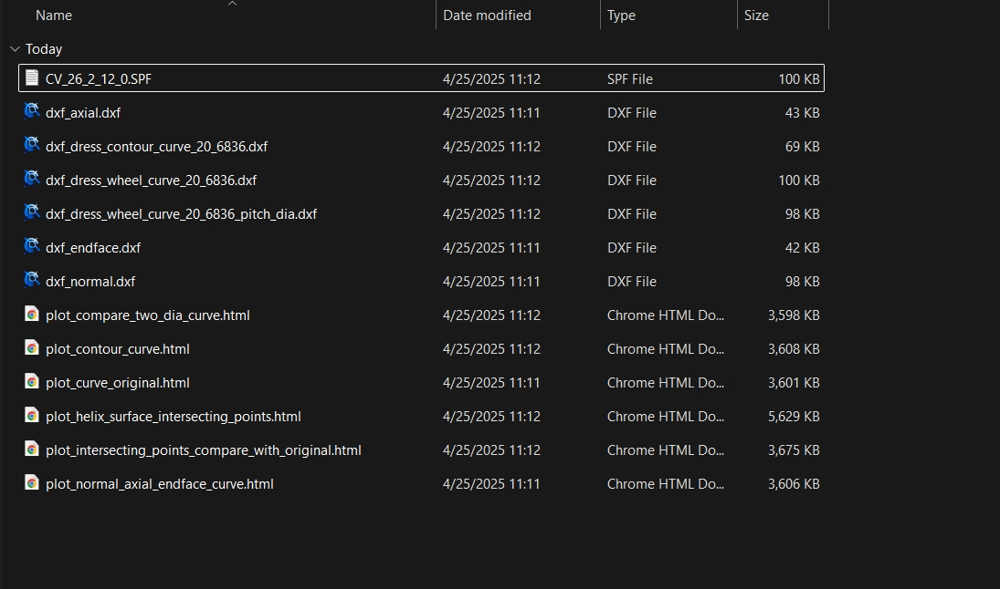

# 生成代码

Cam Grinding 提供便捷的代码生成功能，用户仅需简单配置，即可生成用于凸轮加工的 CNC 代码。

## 参数设置

1. 在 **基本参数** 面板中：
   - 点击 `选择文件` 按钮，在 `DXF文件地址` 参数中导入绘制好的 DXF 格式凸轮文件。
   - 根据数控凸轮磨床的砂轮直径范围，设置 `最大砂轮直径` 和 `最小砂轮直径`。
   - 在 `输出程序路径` 参数中，指定输出凸轮加工代码的目标文件夹。

2. 配置完成后，点击 `生成` 按钮，即可生成凸轮加工代码。

   

## 数据结构

生成完成后，Cam Grinding 会自动打开输出程序目录，并创建以导入的凸轮 DXF 文件名称命名的子文件夹。加工代码及其他相关输出文件将存放于该文件夹中，目录结构如下：
```
CV_文件名
├── 凸轮加工代码
├── 离散点化凸轮DXF文件
├── 多段线化凸轮DXF文件
├── 特定砂轮直径下加工运行轨迹
│   ├── 离散点化DXF文件
│   ├── 多段线化DXF文件
│   ├── 实际运行离散点坐标信息TXT文件
│   └── 凸轮曲线与加工运行曲线对比HTML文件
```

   

生成的凸轮加工代码可直接拷贝至数控凸轮磨床进行加工。

## 默认输出内容

默认情况下，生成的加工代码使用离散点格式，通过 XC 插补的方式运行，包含 3600 个离散点。示例代码如下：

```
;********************************
;砂轮直径范围:396.3000 - 395.3000
;砂轮步距:0.5
;轨迹程序段数:3601
;********************************
;软件版本:1.11.0
;生成日期:2025-01-17 14:04:03
;********************************
;WHEEL_DIA - 当前砂轮直径
;调用此程序前 X C 轴需要移动到起始位置,不需要执行 TRANS 坐标偏移
;********************************
STOPRE;停止预读
IF (WHEEL_DIA>=396.3000) GOTOF DIA_396_3000;
IF (WHEEL_DIA<396.3000) AND (WHEEL_DIA>=395.8000) GOTOF DIA_395_8000;
IF (WHEEL_DIA<395.8000) AND (WHEEL_DIA>=395.3000) GOTOF DIA_395_3000;
IF (WHEEL_DIA<395.3000) GOTOF DIA_395_3000;
;********************************
DIA_396_3000:
G64 G90 G01
TRANS X=$AA_IM[X] C=$AA_IM[C]
COMPCAD
X=0.0000 C=DC(0.0000)
X=0.0000 C=DC(0.0116)
X=0.0001 C=DC(0.1252)
X=0.0006 C=DC(0.2389)
X=0.0015 C=DC(0.3525)
X=0.0015 C=DC(0.3525)
X=0.0028 C=DC(0.4662)
X=0.0046 C=DC(0.5798)
X=0.0067 C=DC(0.6934)
X=0.0091 C=DC(0.8071)
...
...
X=0.0000 C=DC(0.0000)
COMPOF
RET
```


此外，`实际运行离散点坐标信息TXT文件` 提供每个加工点的详细数据，包括坐标、角度和半径差值等：

```
第 0 点 - 坐标: [247.3145, 0.0000], 绝对半径: 247.3145, 绝对角度: 0.0000, 绝对半径差值: 0.0000, 增量半径差值: 0.0000, 增量角度差值: 0.0000
第 1 点 - 坐标: [247.3145, -0.0501], 绝对半径: 247.3145, 绝对角度: 0.0116, 绝对半径差值: 0.0000, 增量半径差值: 0.0000, 增量角度差值: 0.0116
第 2 点 - 坐标: [247.3140, -0.5406], 绝对半径: 247.3146, 绝对角度: 0.1252, 绝对半径差值: 0.0001, 增量半径差值: 0.0001, 增量角度差值: 0.1136
第 3 点 - 坐标: [247.3130, -1.0311], 绝对半径: 247.3151, 绝对角度: 0.2389, 绝对半径差值: 0.0006, 增量半径差值: 0.0005, 增量角度差值: 0.1136
第 4 点 - 坐标: [247.3114, -1.5216], 绝对半径: 247.3160, 绝对角度: 0.3525, 绝对半径差值: 0.0015, 增量半径差值: 0.0009, 增量角度差值: 0.1136
第 5 点 - 坐标: [247.3114, -1.5216], 绝对半径: 247.3160, 绝对角度: 0.3525, 绝对半径差值: 0.0015, 增量半径差值: 0.0000, 增量角度差值: 0.0000
第 6 点 - 坐标: [247.3092, -2.0121], 绝对半径: 247.3174, 绝对角度: 0.4662, 绝对半径差值: 0.0028, 增量半径差值: 0.0013, 增量角度差值: 0.1136
第 7 点 - 坐标: [247.3064, -2.5026], 绝对半径: 247.3191, 绝对角度: 0.5798, 绝对半径差值: 0.0046, 增量半径差值: 0.0017, 增量角度差值: 0.1136
...
...
```

`凸轮曲线与加工运行曲线对比HTML文件` 则通过可视化图表对比加工轨迹和标准凸轮轨迹：

   

## 圆弧拟合

### 功能介绍

Cam Grinding 支持 **圆弧拟合** 功能，可生成优化后的加工代码，显著提升加工效率并减小代码文件大小。

### 启用方法

1. 在 **高级参数** 面板中，将 `圆弧拟合` 选项设置为 `是`。
2. 保持其他参数默认配置，点击 `生成代码` 按钮，即可生成启用了圆弧拟合的加工代码。

   

## 输出内容

启用圆弧拟合后，输出文件目录将包含以下新增内容：
```
特定砂轮直径下加工运行轨迹
├── 圆弧拟合后DXF文件
├── 圆弧拟合后HTML文件
├── 圆弧拟合后TXT文件
```


同时，加工代码将转换为 **TRANSMIT 坐标转换功能**，使用 XY 圆弧插补方式运行：
```
DIA_396_3000:
G64 G90 G01
$MC_TRANSMIT_BASE_TOOL_1[0]=$AA_IM[X]-247.3145
$MC_TRANSMIT_ROT_AX_OFFSET_1=$AA_IM[C]
NEWCONF
TRANSMIT
G01 X=247.3145 Y=0.0000
G01 X=247.3145 Y=0.0000
G02 X=247.2834 Y=-4.9551 CR=404.1318
G02 X=247.1428 Y=-11.3301 CR=350.4227
G02 X=246.6805 Y=-21.6201 CR=364.0336
G02 X=245.7450 Y=-33.8466 CR=352.4801
...
G02 X=247.2849 Y=4.8549 CR=361.3038
G02 X=247.3145 Y=0.0000 CR=367.0095
G01 X=247.3145 Y=0.0000
TRAFOOF
RET
```


`圆弧拟合后HTML文件` 提供直观的圆弧拟合对比效果：

   

`圆弧拟合后TXT文件` 则详细记录每段圆弧的起点、终点和半径等信息：
```
圆弧段:
第 1 段 - 标准起点坐标: [247.3145, 0.0000], 标准终点坐标: [247.2835, -4.9551], 平滑起点坐标: [247.3145, 0.0000], 平滑终点坐标: [247.2834, -4.9551]
          圆弧半径: 404.1318, 圆心坐标: [-156.8173, 0.0494], 圆弧相对圆心角度范围: [359.9930, 359.2905]
第 2 段 - 标准起点坐标: [247.2835, -4.9551], 标准终点坐标: [247.1426, -11.3301], 平滑起点坐标: [247.2834, -4.9551], 平滑终点坐标: [247.1428, -11.3301]
          圆弧半径: 350.4227, 圆心坐标: [-103.1097, -0.4030], 圆弧相对圆心角度范围: [359.2557, 358.2131]
第 3 段 - 标准起点坐标: [247.1426, -11.3301], 标准终点坐标: [246.6806, -21.6201], 平滑起点坐标: [247.1428, -11.3301], 平滑终点坐标: [246.6805, -21.6201]
          圆弧半径: 364.0336, 圆心坐标: [-116.7192, -0.1477], 圆弧相对圆心角度范围: [358.2397, 356.6185]
第 4 段 - 标准起点坐标: [246.6804, -21.6201], 标准终点坐标: [245.7451, -33.8466], 平滑起点坐标: [246.6805, -21.6201], 平滑终点坐标: [245.7450, -33.8466]
          圆弧半径: 352.4801, 圆心坐标: [-105.1874, -0.8531], 圆弧相对圆心角度范围: [356.6224, 354.6290]
第 5 段 - 标准起点坐标: [245.7449, -33.8465], 标准终点坐标: [244.2513, -47.0050], 平滑起点坐标: [245.7450, -33.8466], 平滑终点坐标: [244.2512, -47.0050]
          圆弧半径: 342.2081, 圆心坐标: [-94.9630, -1.8378], 圆弧相对圆心角度范围: [354.6329, 352.4155]
...
```

## 注意事项

使用圆弧拟合功能的加工代码时，需要确保数控系统支持 **TRANSMIT 功能** 并完成相关系统配置。