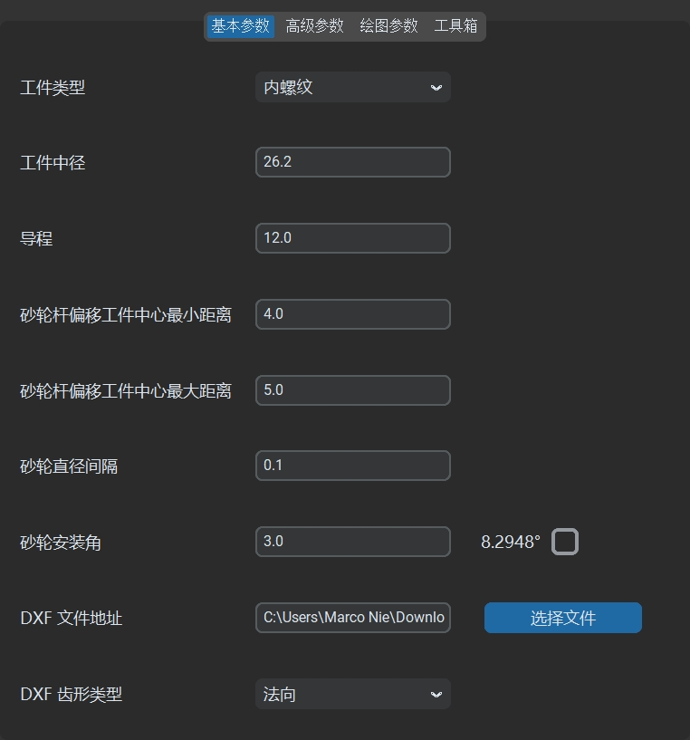
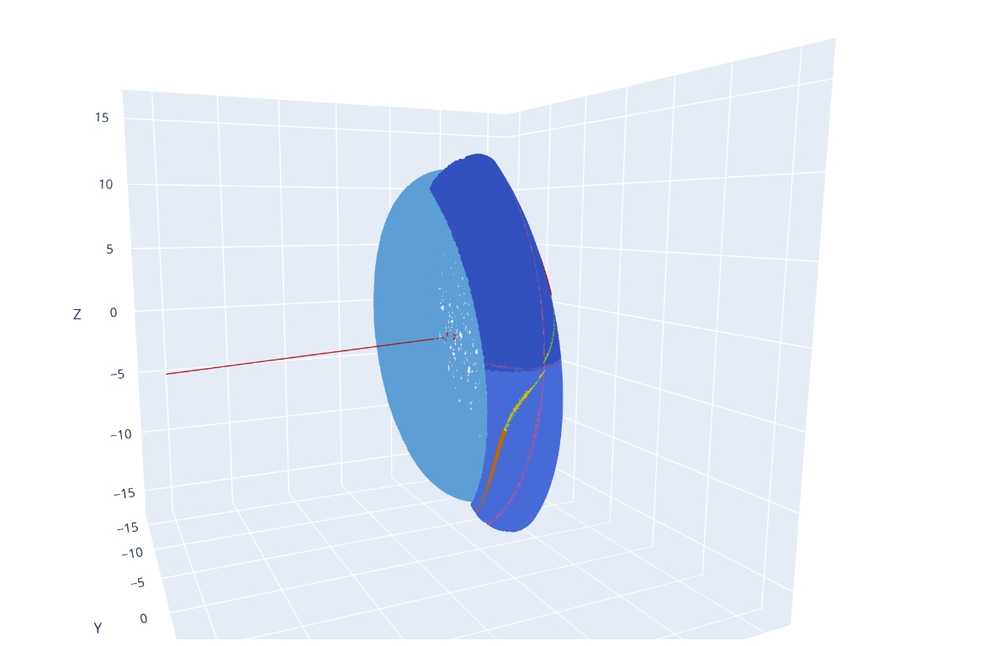
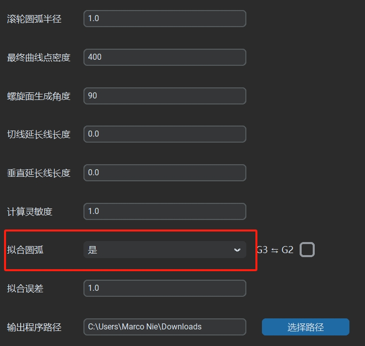

# 生成代码

Interference Grinding Dressing 提供便捷的代码生成功能，用户仅需简单配置，即可生成用于干涉磨削的 CNC 砂轮修整代码。

## 参数设置

1. 在 **基本参数** 面板中：
   - 根据图纸设置`工件类型`/`工件中径`/`工件导程`等数据。
   - 根据砂轮杆直径和工件内径的尺寸，设置 `砂轮杆偏移中心最小距离` 和 `砂轮杆偏移中心最大距离`，可以通过**工具箱-最大偏移**来计算。
   - 根据实际需要设置`砂轮安装角`，右侧数字为标准工件螺旋升角，两者不一样则为干涉磨削。
   - 点击 `选择文件` 按钮，在 `DXF齿型文件` 参数中导入绘制好的 DXF 格式齿型文件，齿型文件原点需要以中径线为基准。
   - 砂轮直径间隔设置 0.1，齿型类型为法向。
   - **高级参数-初始化参数**中，设置实际的`滚轮圆弧半径`。
   - 在 `输出程序路径` 参数中，指定输出修整代码的目标文件夹。
   - 其他参数保持默认即可。

2. 配置完成后，点击 `生成代码` 按钮，即可生成砂轮修整代码。

   
   

## 数据结构

生成完成后，IGD 会自动打开输出程序目录，并创建以**中径和导程**数据命名的子文件夹。修整代码及其他相关输出文件将存放于该文件夹中，目录结构如下：
```
CV_文件名
├── 砂轮修整代码
├── 齿型的法向轮廓DXF文件
├── 齿型的轴向轮廓DXF文件
├── 齿型的端面轮廓DXF文件
└── 输入的齿型轮廓HTML文件
└── 齿型法向/轴向/端面轮廓对比HTML文件
└── 两个相邻砂轮直径间隔下砂轮形状轨迹对比HTML文件
├── 特定砂轮直径下加工运行轨迹
│   ├── 修整出的砂轮形状轨迹DXF文件
│   ├── 以中径线为基准的砂轮形状轨迹DXF文件
│   ├── 修整程序运行的轮廓轨迹DXF文件
│   └── 三维中滚道和砂轮的接触线轨迹HTML文件
│   └── 砂轮修整形状和标准滚道法向截形轨迹对比HTML文件
│   └── 砂轮修整形状和机床实际运行的轮廓轨迹对比HTML文件
```

   

生成的修整代码可直接拷贝至数控机床进行砂轮修整。

## 默认输出内容

默认情况下，生成的修整代码使用离散点格式，通过两轴插补的方式运行，包含 400 个离散点。示例输出代码如下：

```
;********************************
;砂轮直径范围:20.6836 - 20.2837
;砂轮步距:0.1
;轨迹程序段数:402
;********************************
;砂轮杆安装角:3.0
;工件螺旋升角:8.2948
;工件中径:26.2
;工件导程:12.0
;滚轮圆弧半径:1.0
;砂轮齿高：1.7222 - 1.7830
;砂轮齿宽：2.7253 - 2.8244
;********************************
;软件版本:1.7.1
;生成日期:2025-04-25 11:12:35
;********************************
;WHEEL_DIA - 当前砂轮直径
;VER_MODE  - 修整进刀轴方向
;AX_HORI   - 水平修整轴
;AX_VER    - 垂直修整轴
;********************************
DEF REAL VER_MODE,WHEEL_DIA
DEF AXIS AX_HORI,AX_VER
AX_HORI=AXNAME(AXIS_HORI)
AX_VER=AXNAME(AXIS_VER)
VER_MODE=DRESSER[50]
WHEEL_DIA=DRESSER[24]
;********************************
IF (WHEEL_DIA>=20.6836) GOTOF DIA_20_6836;
IF (WHEEL_DIA<20.6836) AND (WHEEL_DIA>=20.5838) GOTOF DIA_20_5838;
IF (WHEEL_DIA<20.5838) AND (WHEEL_DIA>=20.4838) GOTOF DIA_20_4838;
IF (WHEEL_DIA<20.4838) AND (WHEEL_DIA>=20.3844) GOTOF DIA_20_3844;
IF (WHEEL_DIA<20.3844) AND (WHEEL_DIA>=20.2837) GOTOF DIA_20_2837;
IF (WHEEL_DIA<20.2837) GOTOF DIA_20_2837;
;********************************
DIA_20_6836:
IF DRESSER[40]==1;
;*********************************************
DRESSER[41]=89.2161;外部齿形程序右起点角度(竖直向下夹角)
DRESSER[42]=89.4766;外部齿形程序左起点角度(竖直向下夹角)
DRESSER[43]=0;外部齿形程序顶部平台长度(预留参数)
DRESSER[45]=0;齿形右终点角度(竖直向下夹角)
DRESSER[46]=0;齿形左终点角度(竖直向下夹角)
DRESSER[51]=-2.3627;外部齿形程序右终点水平坐标
DRESSER[131]=1.7221;外部齿形程序右终点垂直坐标(考虑VER_MODE)
DRESSER[115]=2.3627;外部齿形程序左终点水平坐标
DRESSER[138]=1.7221;外部齿形程序左终点垂直坐标(考虑VER_MODE)
DRESSER[99]=0.0000
;***********************************************
RET
ENDIF
;齿形部分
CASE DRESSER[44] OF 0 GOTOF RIGHT_SIDE 1 GOTOF LEFT_SIDE DEFAULT GOTOF RIGHT_SIDE
;右侧齿形
RIGHT_SIDE:
G64 G90 G01
AX[AX_VER]=-0.0000*VER_MODE AX[AX_HORI]=0.0000
AX[AX_VER]=-0.0000*VER_MODE AX[AX_HORI]=-0.0079
AX[AX_VER]=0.0001*VER_MODE AX[AX_HORI]=-0.0238
AX[AX_VER]=0.0004*VER_MODE AX[AX_HORI]=-0.0397
AX[AX_VER]=0.0011*VER_MODE AX[AX_HORI]=-0.0555

...

AX[AX_VER]=1.6746*VER_MODE AX[AX_HORI]=-2.3653
AX[AX_VER]=1.6905*VER_MODE AX[AX_HORI]=-2.3648
AX[AX_VER]=1.7063*VER_MODE AX[AX_HORI]=-2.3639
AX[AX_VER]=1.7221*VER_MODE AX[AX_HORI]=-2.3627
RET
;左侧齿形
LEFT_SIDE:
G64 G90 G01
AX[AX_VER]=-0.0000*VER_MODE AX[AX_HORI]=0.0000
AX[AX_VER]=-0.0000*VER_MODE AX[AX_HORI]=0.0079
AX[AX_VER]=0.0003*VER_MODE AX[AX_HORI]=0.0238

...

AX[AX_VER]=1.6746*VER_MODE AX[AX_HORI]=2.3653
AX[AX_VER]=1.6905*VER_MODE AX[AX_HORI]=2.3648
AX[AX_VER]=1.7063*VER_MODE AX[AX_HORI]=2.3639
AX[AX_VER]=1.7221*VER_MODE AX[AX_HORI]=2.3627
RET
;********************************
DIA_20_5838:
IF DRESSER[40]==1;
...

```

`三维中滚道和砂轮的接触线轨迹HTML文件` 通过三维视角清晰的呈现了砂轮和滚道接触线的分布以及其他详细数据：

   

`砂轮修整形状和标准滚道法向截形轨迹对比HTML文件` 可以直观的查看干涉磨削情况下砂轮形状和标准滚道法向截面的区别：

   

## 圆弧拟合

### 功能介绍

Interference Grinding Dressing 支持 **圆弧拟合** 功能，可生成优化后的修整代码，显著提升加工效率并减小代码文件大小。

### 启用方法

1. 在 **高级参数-初始化参数** 面板中，将 `圆弧拟合` 选项设置为 `是`。
2. 保持其他参数默认配置，点击 `生成代码` 按钮，即可生成启用了圆弧拟合的加工代码。

   

## 输出内容

启用圆弧拟合后，输出文件目录将包含以下新增内容：
```
特定砂轮直径下加工运行轨迹
├── 圆弧拟合后DXF文件
├── 圆弧拟合后HTML文件
├── 圆弧拟合后TXT文件
```


加工代码变成如下形式：
```
;右侧齿形
RIGHT_SIDE:
G64 G90 G01
G01 AX[AX_VER]=-0.0000*VER_MODE AX[AX_HORI]=0.0000
G01 AX[AX_VER]=-0.0000*VER_MODE AX[AX_HORI]=0.0000
G03 AX[AX_VER]=0.0066*VER_MODE AX[AX_HORI]=-0.1286 CR=1.1603
G03 AX[AX_VER]=0.3686*VER_MODE AX[AX_HORI]=-1.2981 CR=2.9783
G03 AX[AX_VER]=0.8019*VER_MODE AX[AX_HORI]=-1.8838 CR=2.8127
G03 AX[AX_VER]=1.1230*VER_MODE AX[AX_HORI]=-2.1637 CR=2.4404
G03 AX[AX_VER]=1.2909*VER_MODE AX[AX_HORI]=-2.2692 CR=1.3942
G03 AX[AX_VER]=1.4833*VER_MODE AX[AX_HORI]=-2.3440 CR=0.8617
G03 AX[AX_VER]=1.7221*VER_MODE AX[AX_HORI]=-2.3627 CR=0.7176
G01 AX[AX_VER]=1.7221*VER_MODE AX[AX_HORI]=-2.3627
RET
;左侧齿形
LEFT_SIDE:
G64 G90 G01
G01 AX[AX_VER]=-0.0000*VER_MODE AX[AX_HORI]=0.0000
G01 AX[AX_VER]=-0.0000*VER_MODE AX[AX_HORI]=0.0000
G02 AX[AX_VER]=0.0104*VER_MODE AX[AX_HORI]=0.1664 CR=1.5149
G02 AX[AX_VER]=0.3789*VER_MODE AX[AX_HORI]=1.3165 CR=2.9761
G02 AX[AX_VER]=0.8107*VER_MODE AX[AX_HORI]=1.8929 CR=2.8071
G02 AX[AX_VER]=1.1299*VER_MODE AX[AX_HORI]=2.1686 CR=2.4270
G02 AX[AX_VER]=1.2984*VER_MODE AX[AX_HORI]=2.2731 CR=1.3586
G02 AX[AX_VER]=1.4956*VER_MODE AX[AX_HORI]=2.3470 CR=0.8468
G02 AX[AX_VER]=1.7221*VER_MODE AX[AX_HORI]=2.3627 CR=0.7179
G01 AX[AX_VER]=1.7221*VER_MODE AX[AX_HORI]=2.3627
RET
```

`圆弧拟合后HTML文件` 提供直观的圆弧拟合对比效果：

   

`圆弧拟合后TXT文件` 则详细记录每段圆弧的起点、终点和半径等信息：
```
圆弧段:
第 1 段 - 标准起点坐标: [0.0000, 0.0001], 标准终点坐标: [-0.1286, -0.0067], 平滑起点坐标: [0.0000, 0.0000], 平滑终点坐标: [-0.1286, -0.0066]
          圆弧半径: 1.1603, 圆心坐标: [-0.0033, -1.1603], 圆弧相对圆心角度范围: [89.8361, 96.1964]
第 2 段 - 标准起点坐标: [-0.1286, -0.0067], 标准终点坐标: [-1.2982, -0.3685], 平滑起点坐标: [-0.1286, -0.0066], 平滑终点坐标: [-1.2981, -0.3686]
          圆弧半径: 2.9783, 圆心坐标: [0.1479, -2.9722], 圆弧相对圆心角度范围: [95.3255, 119.0475]
第 3 段 - 标准起点坐标: [-1.2981, -0.3687], 标准终点坐标: [-1.8839, -0.8018], 平滑起点坐标: [-1.2981, -0.3686], 平滑终点坐标: [-1.8838, -0.8019]
          圆弧半径: 2.8127, 圆心坐标: [0.0669, -2.8280], 圆弧相对圆心角度范围: [119.0307, 133.9127]
第 4 段 - 标准起点坐标: [-1.8837, -0.8019], 标准终点坐标: [-2.1638, -1.1229], 平滑起点坐标: [-1.8838, -0.8019], 平滑终点坐标: [-2.1637, -1.1230]
          圆弧半径: 2.4404, 圆心坐标: [-0.1919, -2.5607], 圆弧相对圆心角度范围: [133.8890, 143.9029]
第 5 段 - 标准起点坐标: [-2.1635, -1.1231], 标准终点坐标: [-2.2694, -1.2908], 平滑起点坐标: [-2.1637, -1.1230], 平滑终点坐标: [-2.2692, -1.2909]
          圆弧半径: 1.3942, 圆心坐标: [-1.0404, -1.9491], 圆弧相对圆心角度范围: [143.6701, 151.8267]
...
```

## 注意事项

使用圆弧拟合功能生成修整代码时，需要根据两个插补轴所在的几何平面，判断是否启用 `G3 ↔ G2` 反转选项。