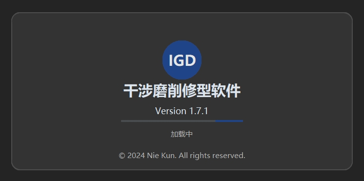
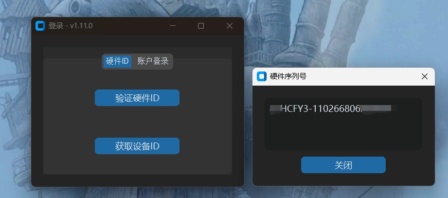
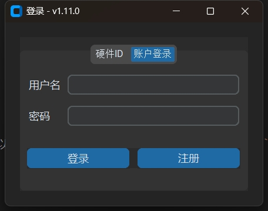

# 软件安装

Cam Grinding 软件安装包需在购买后联系开发者获取：

- **Windows 用户**：下载并安装 `.exe` 文件。
- **macOS 用户**：下载并安装 `.dmg` 文件。

## 安装步骤

### Windows 系统

1. 双击下载的安装包 (`.exe`) 文件。
2. 按照安装向导提示完成安装。
3. 安装完成后，桌面会生成快捷方式，双击即可启动软件。

### macOS 系统

1. 打开下载的 `.dmg` 文件。
2. 将软件图标拖动到“应用程序”文件夹。
3. 在“应用程序”中找到软件图标，双击启动软件。

   

## 获取授权

首次启动软件时，需完成授权验证。您可以通过 **硬件 ID 验证** 或 **账户登录** 的方式获取授权，以便正常使用软件。

### 验证硬件 ID

1. 启动软件后，选择 **硬件 ID 验证**。
2. 点击 `获取设备ID` 按钮，生成当前设备的硬件 ID。

   

3. 将硬件 ID 发送给开发者，开发者将您的设备加入授权名单。
4. 完成授权后，点击 `验证硬件ID` 按钮，进入软件界面。

> **注意**：设备成功授权后，可离线使用，无需联网再次验证。

### 账户登录

1. 启动软件后，选择 **账户登录** 选项卡。
2. 输入账户信息（用户名和密码），点击 `登录` 进入软件界面。

   

3. 如无账户，需先注册。点击左下角的 `注册` 按钮，进入注册界面。

   

4. 在注册界面：
   - 输入必要的注册信息。
   - 使用从开发者处获取的注册码完成注册。
   - 点击 `注册` 按钮提交。

5. 注册成功后，使用注册账号登录软件。

> **注意**：使用账号登录时，设备必须保持联网状态，否则无法完成登录。

---

通过上述步骤，您即可完成 Cam Grinding 软件的安装和授权。如有疑问，请联系开发者获取更多支持。
