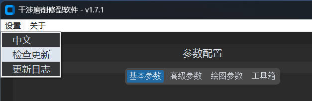
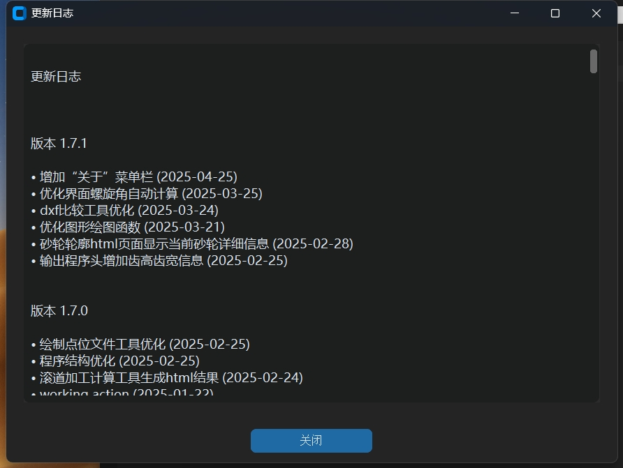

# 软件升级

Interference Grinding Dressing 会定期发布更新，确保用户可以使用最新的功能和性能改进。

## 检查更新

1. 启动软件后，点击菜单栏的 `设置` > `检查更新` 按钮。
2. 软件将自动检查是否有可用的更新版本。
3. 如果检测到新版本，按照提示完成下载与安装。

   

## 查看更新日志

1. 点击菜单栏的 `设置` > `更新日志` 按钮。
2. 在更新日志窗口中，查看每个版本的更新内容，包括新功能、优化项和已修复的问题。

   

---

通过以上步骤，您可以轻松获取软件的最新版本，体验更丰富的功能和更流畅的操作。如在升级过程中遇到问题，请参考[故障排除](troubleshooting/README.md)章节或联系技术支持。
